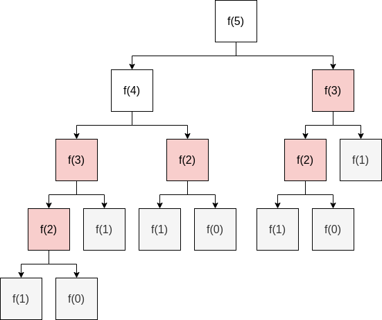

## 피보나치 수열

은근히 여기저기서 많이 튀어나오는 피보나치 수열은 재귀나 DP를 이용해서 쉽게 구할 수 있다. 이외에도 구하는 방법은 여러가지가 있는 것 같지만 자주 쓰는 것만 정리해보았다.

> 수학에서, 피보나치 수(영어: Fibonacci numbers)는 첫째 및 둘째 항이 1이며 그 뒤의 모든 항은 바로 앞 두 항의 합인 수열이다. 처음 여섯 항은 각각 1, 1, 2, 3, 5, 8이다. 편의상 0번째 항을 0으로 두기도 한다.

$f(n)=\begin{dcases}
   0 &\text{if n = 0} \\
   1 &\text{if n = 1} \\
   f(n - 2) + f(n -1) &\text{if n > 1}
\end{dcases}$

정의를 점화식으로 나타내면 위와 같다. 이 점화식을 바탕으로 피보나치 수열을 만드는 방법을 알아보자.

### 재귀

```js
const f = x => {
    if (x === 0 || x === 1) return x;
    return f(x - 2) + f(x - 1);
};

const fib = n => {  
    const ret = [0, 1];
    for (let i = 2; i < n; i += 1) {
        ret[i] = f(i);
    }
    return ret;
};

fib(n);
```

앞선 점화식을 바탕으로 재귀적으로 피보나치 수를 구한다. 근데 이 방법은 $n$이 50만 되어도 엄청나게 오래걸리게 되는데 그 이유는 중복해서 연산을 하기 때문.



위 그림의 붉게 표시된 부분과 같이 계산했던 값을 다시 계산해야 하기 때문에 깊이가 깊어지게 된다. 이때 중복되는 값을 메모이제이션해서 연산을 줄일 수 있다. 시간복잡도는 $O(2^n)$이다.

### 동적 계획법

```js
const dp = [0, 1];
const f = x => {
    if (x === 0) return 0;
    if (dp[x]) return dp[x];
    return dp[x] = f(x - 2) + f(x - 1);
};

f(n);
```

상기된 재귀를 이용한 방법에서 이미 연산된 값이 있다면 바로 반환하고 그렇지 않으면 `dp`배열에 저장해서 바로 반환하도록 해서 중복되는 연산을 제거했다. 시간복잡도는 $O(n)$이다.

### 피사노 주기

```js
const dp = [0, 1];
const f = k => x => {
    if (x === 0) return 0;
    if (dp[x]) return dp[x];
    return dp[x] = (fib(x - 2) + fib(x - 1)) % k;
};
const fib = f(k);

fib(n);
```

피보나치 수열의 각 수를 어떤 수로 모듈로 연산을 하면 이 수들이 주기를 띄게 되는데 이를 피사노 주기(Pisano period)라고한다. 피보나치 수열을 이용해서 매우 큰 값을 모듈로 연산하여 값을 반환해야할 때 쓰면 좋다. 예를 들면 `[0,  1,  1,  2,  3,  5, 8, 13, 21, 34, 55, 89, 144]`와 같은 피보나치 수열은 각 원소를 4로 모듈로 연산을 하게 되면 `[0, 1, 1, 2, 3, 1, 0, 1, 1, 2, 3, 1, 0]` 처럼 주기의 길이가 6인 `011231`인 주기를 형성한다.

## 참조(Reference)

- "피보나치 수", *Wikipedia*, https://ko.wikipedia.org/wiki/%ED%94%BC%EB%B3%B4%EB%82%98%EC%B9%98_%EC%88%98
- "Pisano period", *Wikipedia*, https://en.wikipedia.org/wiki/Pisano_period