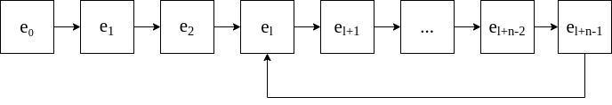
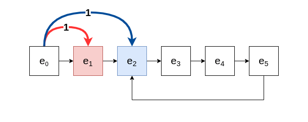

## 사이클 탐지

그래프에서 **사이클(cycle)**은 **순환 경로(cyclic path)**나 **루프(loop)**등으로 불리기도 하며 자기 자신과 연결되는 경로를 말하며 경로의 시작점과 끝나는 정점이 같다. 그래프나 연결 리스트에서 사이클의 존재 유무를 파악해야할 경우가 있는데 사이클을 탐지하는 방법은 DFS, 유니온 파인드, SCC 등등 여러가지 방법을 통해서 알아낼 수 있다.

## 플로이드의 사이클 탐지 알고리즘

**플로이드의 사이클 탐지 알고리즘(Floyd's cycle detection algorithm)은 리스트에 대해 순회 속도가 다른 2개의 포인터를 사용하여 해당 리스트의 사이클 유무를 판단할 수 있는 알고리즘이다.** 이 알고리즘은 플로이드의 거북이와 토끼(Floyd's tortoise and hare) 이라고 불리기도 하는데 이는 이솝 우화에 나오는 토끼와 거북이에서 이름을 따온 것이다. 아무래도 알고리즘의 특성이 그와 비슷하기 때문이 아닐까 생각한다.

### 알고리즘



그림과 같은 리스트가 있을 때 서로 다른 속도로 이 리스트를 순회하는 포인터 $P_h$와 $P_t$가 있다고 하자. 이 때 $h > t$이다. $P_h$와 $P_t$는 리스트를 순회하다가 루프에 진입하게 된다. 이후 루프를 순환하게 될 것이다. 그러다 보면 $P_h$가 $P_t$보다 빠르게 움직이기 때문에 둘이 같은 지점에서 만날 수 있을 것이다. 그렇게 되면 리스트내에 사이클이 존재하는 것을 알 수 있게된다.

먼저 사이클의 크기 $n$을 알아내야 하는데 플로이드의 알고리즘에서는 $h = 2$로 $t = 1$로 두고 리스트를 순회한다. 시작 지점인 $e_0$에서 출발했을 때 $l$번의 반복 이후 $P_t$는 사이클이 시작되는 지점인 $e_l$에 도착하고 $P_h$는 $e_l$보다 $x$번 만큼 앞선 $2l$ 지점에 위치한다.

> $x \equiv l \mod\ n$

만약 $x = 0$이라면 더 이상의 순회를 진행하지 않아도 된다. 이미 둘이 같은 지점에 있기 때문이다. 그렇다면 $0 < x < n$인 경우에는 어떻게 할까?

 한 번 더 순회하면 $P_h$는 $x+1$만큼 앞서 있고 다시 한 번 더 순회하면 $x + 2$만큼 앞서 있다. 계속 해서 $n-x$ 만큼 순회를 진행하면 $P_h$는 $P_t$에 비해 $x+(n-x)=n$ 만큼 앞서 있게 된다. 사이클의 길이가 $n$이므로 $n$의 배수만큼 돈다는 것은 제자리로 온다는 뜻이므로 둘은 이때 만나게 되고 이 지점$e_{l+n-x \mod\ n}$ 을 Meeting-Element라고 한다. $n-x < n$ 이므로

> $MeetingElement = e_{l+n-x}$

이제 이것을 일반화 시켜서 $h$와 $t$가 다른 값일 때를 가정하고 두 포인터가 만나기 까지 걸리는 순회 횟수 $T$를 구하면 다음과 같다.

> $T = l + (n-x) = l + n - (l \mod\ n)$

유클리드의 나눗셈 정리를 이용하면

> $l = nq + r = r \mod\ n$ \
> $r \equiv l \mod\ n$

이를 $T$에 대입한다.

> $T = nq + (l \mod\ n) + n - (l \mod\ n) = n(q+1)$

따라서 두 포인터가 만나기 위한 횟수 $T$는 항상 $n$의 배수가 된다는 것을 알 수 있다. $0 \leq (l \mod n)\leq (n-1)$이므로

> $l + n - (n - 1) \leq T \leq l + n - 0$ \
> $l + 1 \leq T \leq l + n$

또한 $l < n$ 이므로

> $T = l + n - (l \mod\ n) = l + n - l = n$

따라서 $T$는 사이클의 길이인 $n$이다.
$e_l$의 위치는 다음으로 구할 수 있다.

> $l - x = T - n$ \
> $e_{l + (n-x+x) \mod\ n} = e_{l}$

정리하면 다음과 같다.

- 두 포인터가 만나기 위한 순회 횟수 $T$는 항상 $n$이거나 $n$의 배수이다.
- $P_t$가 $e_l$에 도달했다는 것은 $l$번의 반복을 진행했다는 것이고 $P_h$는 $x$만큼 앞선 $2l$에 위치해있다.
- 사이클의 길이를 구하려면 $P_h$는 그대로 두고 $P_t$를 진행시켜 다시 $P_h$를 만날 때까지 순회하면 $n$의 길이를 구할 수 있다.

이외에 $h > t$이고 둘이 같은 노드에서 출발할 때, $h$와 $t$에 대해서 일반화 할 수 있다고 한다.

### 예시



- $P_t$와 $P_h$가 $e_4$에서 만나므로 $e_{l+n-x} = e_4$
- $P_h$는 그대로 두고 $P_t$를 계속 진행시켜서 다시 $P_h$를 만날 때까지 걸리는 반복 횟수가 $n$이므로 $n=4$이다.
- $P_t$가 $e_l$일 때 $P_h$는 $e_{2l} = e_{l+x}$이므로 $l = 2$이다.

## Javascript 구현

```js
class ListNode {
    constructor(val) {
        this.val = val;
        this.next = null;
    }

    push(val) {
        this.next ? this.next.push(val) : this.next = new ListNode(val);
    }
}

function isCyclic(head) {
    let slower = head, faster = head;
    let flag = false;

    while (slower && faster && faster.next) {
        slower = slower.next;
        faster = faster.next.next;

        if (slower === faster) {
            flag = true;
            break;
        }
    }
    return flag;
}
```

## C++ 구현

```cpp
struct ListNode
{
    string val;
    ListNode* next;
};

class List {
    public:
        ListNode* head;

        void push(string val) {
            ListNode* node = new ListNode();
            node->val = val;
            node->next = nullptr;

            if (head == nullptr) {
                head = node;
            }
            else {
                ListNode* t = head;
                while (t->next != nullptr) {
                    t = t->next;
                }
                t->next = node;
            }
        }

        bool isCyclic(ListNode* head) {
            ListNode* slower = head;
            ListNode* faster = head;
            bool flag = false;

            while (slower && faster && faster->next) {
                slower = slower->next;
                faster = faster->next->next;
                if (slower == faster) {
                    flag = true;
                    break;
                }
            }
            return flag;
        }
};
```


## 참조(Reference)

- "Proof of Floyd Cycle Chasing (Tortoise and Hare)", *StackExchange*, https://math.stackexchange.com/questions/913499/proof-of-floyd-cycle-chasing-tortoise-and-hare.
- "Cycle Detection", *Wikipedia*, https://en.wikipedia.org/wiki/Cycle_detection.
- "순환(그래프 이론)", *Wikipedia*, https://ko.wikipedia.org/wiki/%EC%88%9C%ED%99%98_(%EA%B7%B8%EB%9E%98%ED%94%84_%EC%9D%B4%EB%A1%A0).
- "나눗셈 정리", *Wikipedia*, https://ko.wikipedia.org/wiki/%EB%82%98%EB%88%97%EC%85%88_%EC%A0%95%EB%A6%AC.
- Nitin Verma, "Cycle Detection Algorithm", *Maths Anew*,  https://mathsanew.com/articles_html/2/cycle_detection.html.
- "Dectect loop in a linked list", *GeeksforGeeks*, https://www.geeksforgeeks.org/detect-loop-in-a-linked-list/.