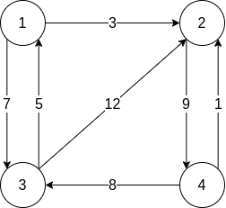
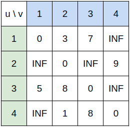
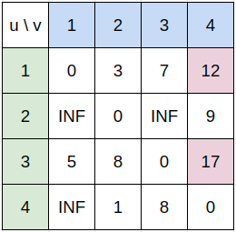
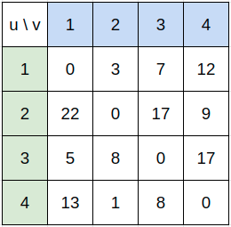

## 모든 쌍 최단 경로 알고리즘

하나의 시작점과 하나의 도착점의 최단 거리를 구하는 경우 다익스트라 알고리즘을 사용하면 되는데 모든 정점쌍에 대해서 최단 거리를 구해야할 때도 다익스트라를 사용해서 구할 수 있다. 음수 가중치가 있는 경우라면 벨만-포드 알고리즘을 사용하면 된다. 그러나 모든 쌍에 대해 최단 거리를 구하는데에는 이 보다 더 효율적인 방법이 있는 바로 **플로이드-와샬 알고리즘**이다. 이 알고리즘은 그래프의 모든 정점 쌍의 최단 거리를 저장하는 2차원 배열$A[][]$을 저장한다. $A[u][v]$는 정점 $u$에서 정점 $v$까지의 최단 거리를 나타낸다.

임의의 두 정점 $u$와 $v$를 지나는 어떤 경로가 있다고 할 때 이 경로를 지나쳐 가는 정점을 경유점이라고 하자. 이 경로는 $u$와 $v$를 반드시 포함한다. 이외에 $u$와 $v$를 직접 잇는 간선이 없거나 경로상에서 다른 정점을 들러 가는 것이 전체 경로를 더 짧게 만드는 경우도 존재한다. 정점 집합 $V$에 포함된 정점만을 경유점으로 사용해 $u$에서 $v$로 가는 최단 경로를 $D_V(u, v)$라고 표현한다면 그림 1의 그래프에서 두 정점을 직접 잇는 경로 $D_{\{\}}(3, 2) = 12$이지만 정점 $1$과 $2$를 경유하여 가는 $D_{\{1, 2\}}(3, 2) = 8$이 된다.


<center style="color: gray; font-size: 14px;">그림 1</center>

$V$에 포함된 정점 집합만을 이용해 $u$에서 $v$로 가는 최단 경로가 있다고 할 때 최단 경로는 $V$의 임의의 정점 $x$를 경유할 수도 있고 아닐 수도 있다.

1. 경로가 $x$를 경유하지 않는다.
    - 이 경로는 $D_{V - \{x\}}(u, v)$로 $V - \{x\}$에 포함된 정점들만 경유점으로 사용한다.
2. 경로가 $x$를 경유한다.
    - 이 경로는 $D_{V - \{x\}}(u, x)$와 $D_{V - \{x\}}(x, v)$의 두 경로로 나뉘며 이 둘은 모두 $u$와 $x$, $x$와 $v$를 잇는 최단 경로여야 한다.
    - 또한 두 개의 경로 모두 $V - \{x\}$에 포함된 정점들만 경유점으로 사용한다.

따라서 $u$에서 $v$로 가는 최단 경로 $D_V(u, v)$는 둘 중 더 짧은 것이 된다. 이를 점화식으로 나타내면 다음과 같다.

$D_V(u, v)=min\begin{dcases}
   D_{V-\{x\}}(u, x) + D_{V-\{x\}}(x, v) \\
   D_{V-\{x\}}(u, v)
\end{dcases}x \in S$

## 구현

앞의 점화식을 변형하여 동적 계획법으로 풀이할 수 있는데 $V_k = \{1, 2, ..., k\}$라 하고 $A_k = D_{S_k}$라고 하면 $A_k{u, v}$는 $1$번 정점부터 $k$번 정점까지만 경유점으로 사용했을 때 $u$에서 $v$로가는 최단 경로의 길이가 되고 이 값은 $A_k(u, v)$의 값은 $A[k][u][v]$에 저장된다. $w(u, v)$가 두 정점 $u$와 $v$의 간선의 가중치라고 한다면 아래와 같이 나타낼 수 있다.

$A_k(u, v)=\begin{dcases}
    w(u, v) \quad \text{if k = 0} \\
    min(D_{k-1}(u, v),\ D_{k-1}(u, x) + D_{k-1}(x, v)) \quad \text{if k} \geq 1
\end{dcases}$

이를 이용해 코드로 구현하면 아래와 같이 나타낼 수 있다. 시간 복잡도와 공간 복잡도는 $O(|V|^3)$이다.

```js
const V = 4, INF = 987654321;
const A = Array.from(Array(V), () => Array.from(Array(V), () => Array(V).fill(0)));
const data = `
0 3 7 X
X 0 X 9
5 12 0 X
X 1 8 0
`.trim().split('\n').map(d => d.split(' ').map(e => e === 'X' ? INF : parseInt(e)));

for (let i = 0; i < V; i += 1) {
    for (let j = 0; j < V; j += 1) {
        A[0][i][j] = Math.min(data[i][j], data[i][0] + data[0][j]);
    }
}

for (let k = 1; k < V; k += 1) {
    for (let i = 0; i < V; i += 1) {
        for (let j = 0; j < V; j += 1) {
            A[k][i][j] = Math.min(
                A[k - 1][i][j],
                A[k - 1][i][k] + A[k - 1][k][j]
            );
        }
    }
}
```

그림 1의 초기 상태 $A_0$를 인접 배열 형태로 나타내면 그림 2와 같다. 자기 자신으로 가는 간선은 없더라도 최단 거리가 0이고 두 정점을 직접 잇는 간선이 없는 경우는 매우 큰 값으로 설정한다.


<center style="color: gray; font-size: 14px;">그림 2</center>

$k$의 첫 순회를 마치게 된다면 그림 3처럼 변하게 될 것이다. 변동된 값은 별색으로 칠하였다.


<center style="color: gray; font-size: 14px;">그림 3</center>

- $D_{2}(1, 4) = 12$
1번 노드에서 4번 노드를 잇는 간선은 없지만 1번 노드에서 2번 노드를 경유하고 2번 노드에서 4번 노드를 경유해 12가 된다. 
- $D_{1, 2}(3, 4) = 17$
4번 노드에서 3번 노드로 갈 수 있지만 3번 노드에서 4번 노드로 갈 수는 없었다. 그러나 3번에서 1번, 1번에서 2번, 2번에서 4번 노드를 경유하여 17이 된다.

순회를 끝낸 최종적인 결과는 그림 4와 같이 된다.


<center style="color: gray; font-size: 14px;">그림 4</center>

### 메모리 사용 줄이기

앞선 점화식을 보면 $A_k(u, v)$의 계산에 필요한 값은 $A_{k-1}(u, k)$와 $A_{k-1}(k, v)$이다. 도착 지점이 $k$인 경우 $A_{k-1}(u, k)$와 $A_{k}(u, k)$는 크게 다르지 않다.

- $A_{k-1}(u, k)$
    - 정점 $u$부터 $k-1$번 정점까지를 경유점으로 이용하여 $k$로 가는 최단 경로의 길이
- $A_{k}(u, k)$
    - 정점 $u$부터 $k$번 정점까지를 경유점으로 이용하여 $k$로 가는 최단 경로의 길이

이를 이용해 코드를 고쳐 공간 복잡도를 $O(|V|^2)$으로 줄일 수 있다.

```js
const V = 4, INF = 987654321;
const A = `
0 3 7 X
X 0 X 9
5 12 0 X
X 1 8 0
`.trim().split('\n').map(d => d.split(' ').map(e => e === 'X' ? INF : parseInt(e)));

for (let k = 0; k < V; k += 1) {
    for (let i = 0; i < V; i += 1) {
        for (let j = 0; j < V; j += 1) {
            A[i][j] = Math.min(
                A[i][j],
                A[i][k] + A[k][j]
            );
        }
    }
}
```

## 참조(References)
- 구종만, *알고리즘 문제 해결 전략*, (인사이트, 2012).
- "플로이드-워셜 알고리즘", *Wikipedia*, https://ko.wikipedia.org/wiki/%ED%94%8C%EB%A1%9C%EC%9D%B4%EB%93%9C-%EC%9B%8C%EC%85%9C_%EC%95%8C%EA%B3%A0%EB%A6%AC%EC%A6%98