## 최소 신장 트리

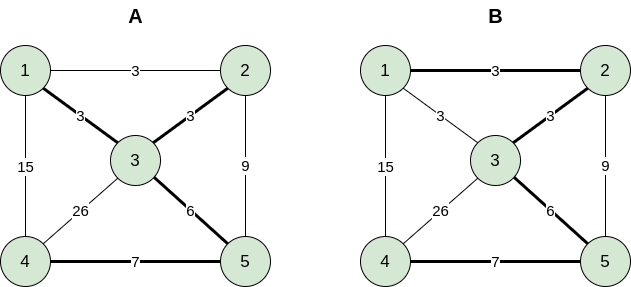

최소 신장 트리(MST, Minimum Spanning Tree)는 그래프 $G = (V, E)$에서 정점 집합 $V$에 대해 간선의 가중치의 합이 최소가 되는 간선의 개수를 $V - 1$개만 남겨 놓은 트리이다. 트리임으로 사이클이 존재하면 안 되며 그래프에 따라 MST는 여러 형태로 존재할 수도 있다. 위의 그림 A와 B모두 MST이다.

그래프에서 MST를 구하는 대표적인 알고리즘 두 가지가 있는데 **크루스칼 알고리즘(Kruskal's algorithm)**과 **프림 알고리즘(Prim's algorithm)**이 있다. 크루스칼의 알고리즘은 **상호 배타적 집합(disjoint set)** 자료구조를 사용하는 좋은 예이고 프림의 알고리즘의 경우 그래프에서 최단 거리를 찾는 **Dijkstra's algorithm**과 형태가 유사하다.

## Kruskal's Algorithm

크루스칼의 알고리즘은 가중치가 작은 것들 먼저 선택하는 것을 기본적인 알고리즘으로 둔다. 요약하자면 다음과 같다.

- 간선들을 가중치를 기준으로 오름차순으로 정렬.
- 간선들을 순서대로 하나씩 선택하며 이미 선택된 간선들과 **사이클(cycle)**을 형성하면 선택하지 않는다.
- $V-1$개의 간선이 선택되면 종료한다.

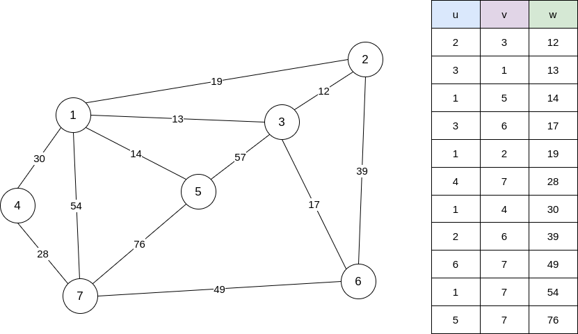

먼저 위와 같이 생긴 그래프가 있다고 할 때 가중치가 낮은 순서대로 정렬하면 그림의 오른쪽 테이블처럼 정렬을 할 수 있다. 이미 선택된 정점들은 `T` 집합에 속한다고 하자.

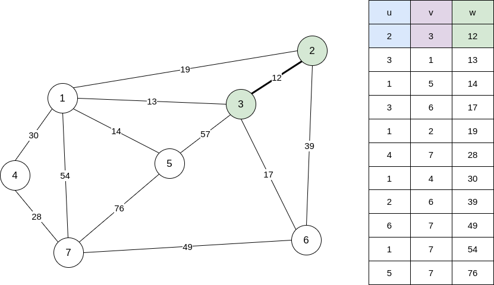

정렬된 테이블을 기반으로 가중치가 제일 낮은 간선을 확인한다. 정점 `2`와 `3`을 연결하는 간선을 `T`에 속하게 한다.

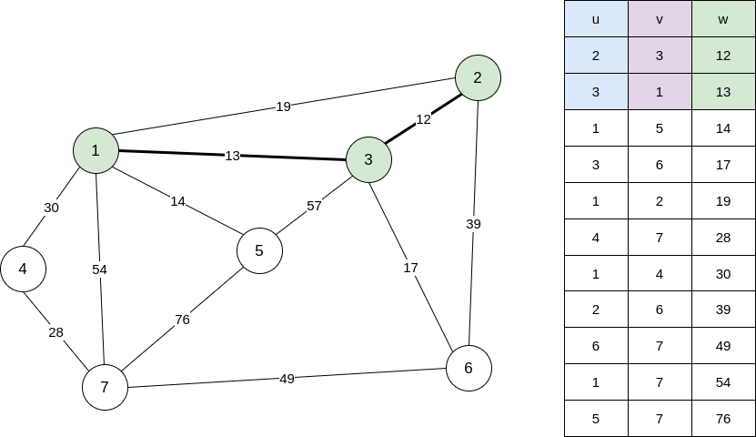

`3`과 `1`을 연결하는 간선을 `T`에 포함시킨다.

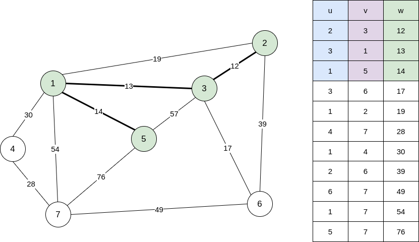

`1`과 `5`를 연결하는 간선을 `T`에 포함시킨다.

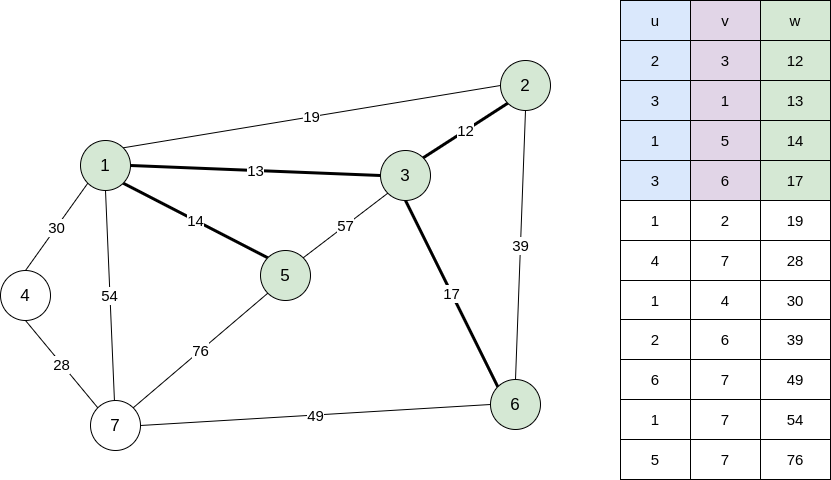

`3`과 `6`를 연결하는 간선을 `T`에 포함시킨다.

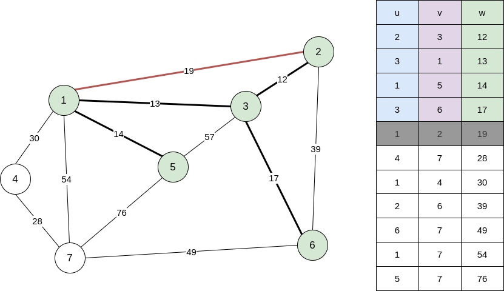

이제 가중치가 가장 작은 간선은 `1`과 `2`를 연결하는 간선이다. 하지만 해당 간선을 선택할 경우 `1`, `2`, `3`을 연결하는 사이클이 생기게 되므로 선택하지 않는다.

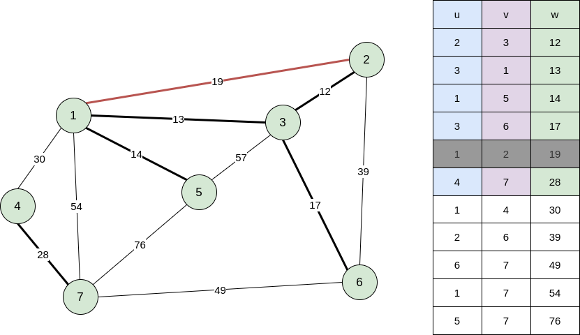

`4`과 `7`를 연결하는 간선을 `T`에 포함시킨다.

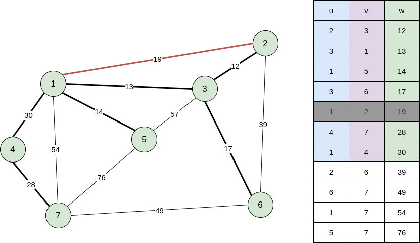

`1`과 `4`를 연결하는 간선을 `T`에 포함시킨다.

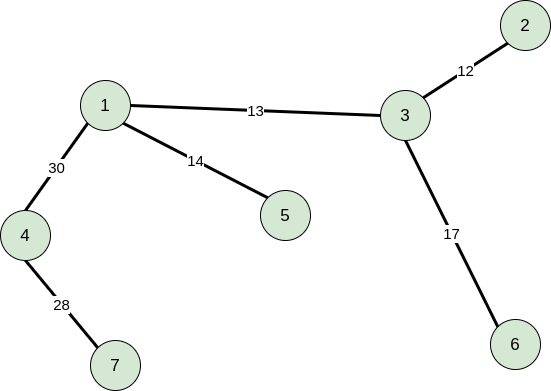

선택된 간선 집합 `T`만 남겨두면 위 그림과 같은 형태가 되며 가중치의 합은 `114`이다.

### 구현

```js
const g = [
    [1, 2, 19],
    [1, 3, 13],
    [1, 4, 30],
    [1, 5, 14],
    [1, 7, 54],
    [2, 3, 12],
    [2, 6, 39],
    [3, 6, 17],
    [3, 5, 57],
    [4, 7, 28],
    [5, 7, 76],
    [6, 7, 49]
], mst = [], V = 7;

g.sort((a, b) => a[2] - b[2]);
```

먼저 간선의 정보를 담는 `g` 배열과 찾은 간선들의 정보를 담을 `mst` 배열과 정점의 개수를 선언하였다. 그리고 `[정점1, 정점2, 가중치]`의 형태로 `g` 배열에 삽입 해주고 가중치가 작은 순으로 정렬한다.

```js
const set = new DisjointSet();
set.makeSet(V);

for (let i = 0; i < g.length; i += 1) {
    if (mst.length >= V - 1) break;
    const [u, v, w] = g[i];
    if (set.find(u) !== set.find(v)) {
        set.union(u, v);
        mst.push(w);
    }
}
```

유니온-파인드 자료 구조를 이용해서 집합을 생성하고 `mst`의 크기가 $V - 1$이 될 때까지 반복문을 순회하면서 `u`와 `v`가 같은 집합에 속하지 않을 경우 병합하여 같은 집합에 속하게 하고 가중치 정보를 `mst`에 삽입한다.


유니온-파인드에 관련 포스트는 [여기](https://www.apexcel.blog/algorithm/graph/union-find/union-find/)에서 볼 수 있다.

### 시간복잡도 분석

- 먼저 V8엔진에서는 2018년 이후부터는 [Timsort](https://en.wikipedia.org/wiki/Timsort)를 사용해 정렬을 한다. 정렬할 때 최악의 경우 $O(nlogn)$ 이므로 $O(ElogE)$가 걸린다. [V8 소스코드](https://github.com/v8/v8/blob/78f2610345fdd14ca401d920c140f8f461b631d1/third_party/v8/builtins/array-sort.tq#L5)
- 집합을 구성하는데 $O(V)$가 걸린다.
- `while`문의 경우 최소 $V - 1$에서 최대 $E$번 까지 수행한다.
- `pop()`는 상수 시간에 해결된다.
- 유니온-파인드 자료구조에서 경우 path compression과 weighted-union을 거쳤다면 집합에 대한 연산은 $log^*V$ 만큼의 시간이 걸리는데 이는 거의 상수로 취급할 수 있다.
- 따라서 크루스칼의 알고리즘은 정렬에 걸리는 시간에 좌우된다고 볼 수 있으므로 최종적으로 $O(ElogE)$이다.

> $O(ElogE) + O(V) + O(E) = O(ElogE)$

## Prim's Algorithm

크루스칼의 알고리즘이 임의의 간선 중 가중치가 가장 작은 것부터 선택하여 각 간선들을 병합하는 과정이었다면 프림의 알고리즘은 시작 정점으로부터 모든 정점을 포함하는 집합을 만들 때까지 진행된다.

먼저 시작 정점을 제외한 모든 정점의 가중치 정보를 `INF`로 초기화하고 시작 정점은 0으로 초기화한다. 먼저 시작 정점의 인접한 정점들의 가중치를 갱신하고 이후 선택되지 않은 정점 집합 중 가중치가 가장 작은 정점을 선택하고 해당 정점의 인접 정점들의 가중치를 갱신한다. 이 과정을 반복하며 모든 정점을 선택하게 되면 종료된다. 아래 그림에서 선택된 정점들은 녹색을 값이 갱신되는 정점들은 파란색으로 표시했다.

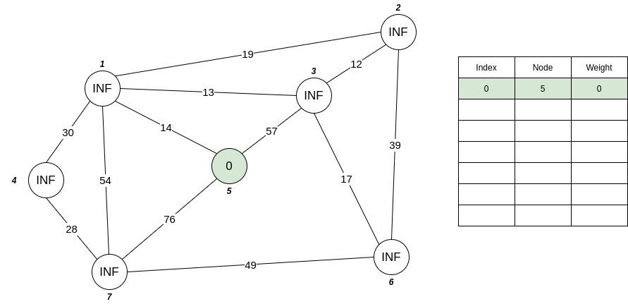

시작 정점을 `5`번 노드로 선택했다. 가중치 `0`으로 초기화하고 나머지 정점들을 `INF`로 초기화 했다.

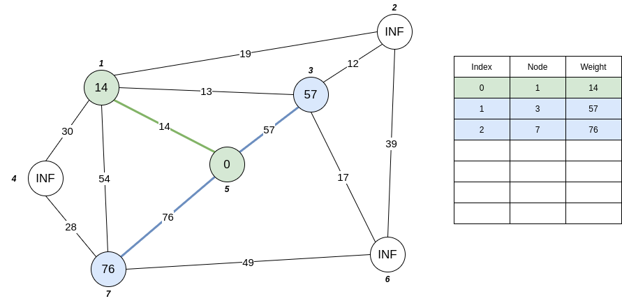

시작 정점의 인근 정점들의 가중치를 새롭게 갱신한다. 그 중 가중치가 가장 작은 `1`번 노드로 이동한다.

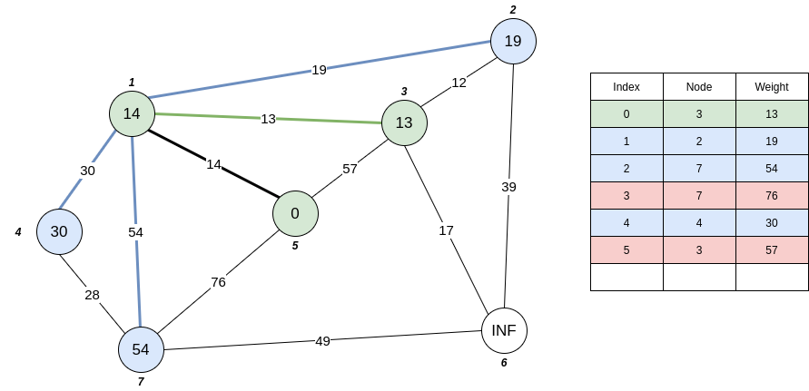

인접 정점들의 가중치를 갱신하고 가중치가 가장 작은 `3`번 노드로 이동한다.

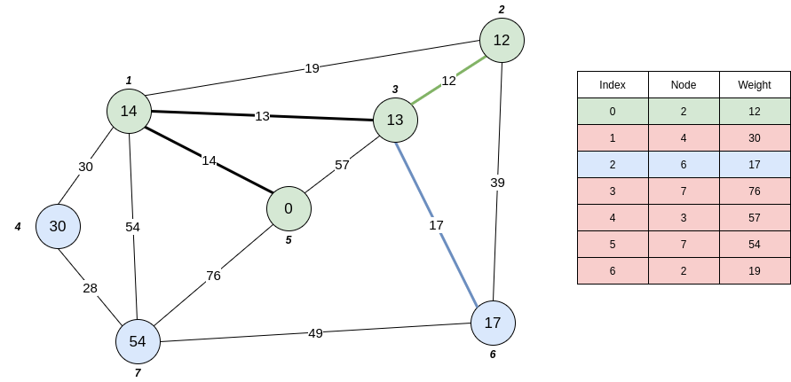

인접한 정점들의 가중치를 갱신하고 `2`번 노드로 이동한다.

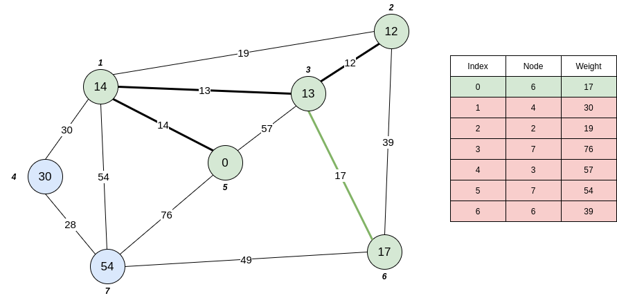

`2`번 노드에서 인접 노드들은 방문 했거나 사이클을 형성하므로 우선 순위 큐에서 가장 작은 가중치를 가진 `6`번 노드로 이동한다.

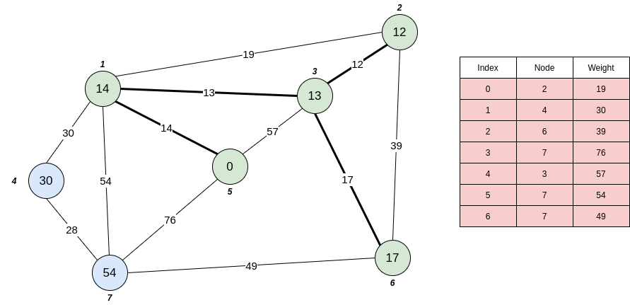

우선 순위 큐에서 첫 요소는 `2`번 노드를 가리키지만 이미 방문을 했기 때문에 우선 순위 큐에서 제거 하고 다음 인덱스로 넘어간다.

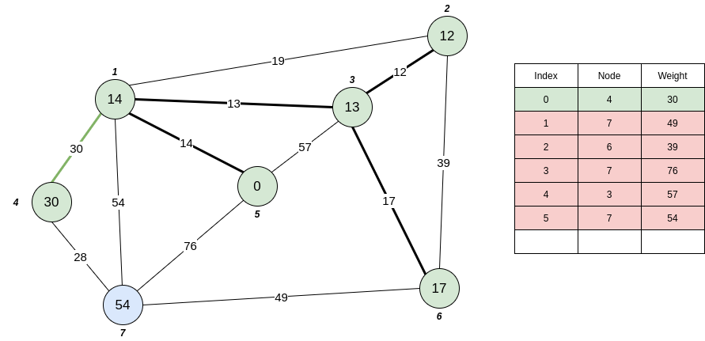

이제 방문하지 않은 노드 중 가중치가 가장 작은 `4`번 노드로 방문한다.


`4`번 노드의 인접 정점을 갱신하고 모든 정점이 선택되었기 때문에 종료된다.

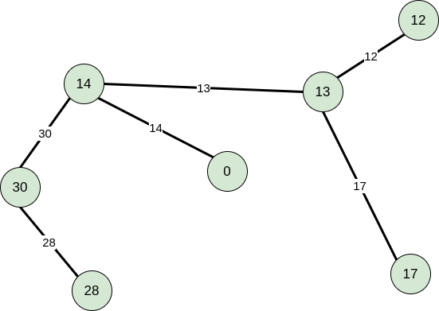

모든 정점들이 선택되었고 선택되지 않은 간선들을 지우게되면 크루스칼과 같은 모양을 띄는 것을 볼 수 있다.

### 구현

```js
const V = 7, E = 12;
const g = Array.from(Array(V + 1), () => Array());
const data = [
    [1, 2, 19],
    [1, 3, 13],
    [1, 4, 30],
    [1, 5, 14],
    [1, 7, 54],
    [2, 3, 12],
    [2, 6, 39],
    [3, 6, 17],
    [3, 5, 57],
    [4, 7, 28],
    [5, 7, 76],
    [6, 7, 49]
];

data.forEach(datum => {
    const [u, v, w] = datum;
    g[u].push([v, w]);
    g[v].push([u, w]);
});
```

크루스칼과 다르게 프림의 경우 각 정점의 정보가 필요하기 때문에 각 정점마다 인접한 정점의 정보를 가지고 있어야한다. 따라서 2차원 배열에 각 정점의 인접 정점의 정보를 담아준다.

```js
const cmp = (a, b) => a[1] < b[1];

const Prim = (graph, begin) => {
    const pq = new MinHeap(null, cmp);
    const isVisited = Array(V + 1).fill(false);
    const mst = [];
    pq.insert([begin, 0]);

    while (pq.heap.length > 0) {
        if (mst.length >= V) break;
        const [node, weight] = pq.pop();
        
        if (!isVisited[node]) {
            isVisited[node] = true;
            mst.push(weight);

            for (let i = 0; i < graph[node].length; i += 1) {
                const link = graph[node][i];
                if (!isVisited[link[0]]) pq.insert(link);
            }
        }
    }
    return mst;
};
```

`pq`는 우선 순위 큐(최소 힙)으로 매개변수로 배열과 비교 함수를 받는다. 비교 함수로 사용될 함수는 `cmp`이며 매개변수 `a`가 더 작은 값인지 확인한다.

방문한 정점인지 아닌지 확인하기 위해 `isVisited`배열과 선택된 정점들을 담을 `mst`배열을 선언한뒤 `pq`의 시작 정점의 가중치를 `0`으로 초기화한다.

`while`문은 큐가 비어 있을 때까지 반복한다. 모든 정점을 선택했음에도 큐에 값이 들어 있을 수 있기 때문에 모든 값이 선택 되었다면 반복문을 탈출한다.

큐에서 가장 작은 가중치를 가진 값을 가져오고 만약 해당 정점을 방문하지 않았다면 `mst`에 값을 담고 해당 정점을 방문하였다고 표시한다. 그리고 해당 정점에 연결된 정점들 중 방문하지 않은 정점들의 정보를 큐에 새롭게 삽입한다.

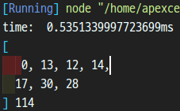

### 시간 복잡도 분석

프림의 알고리즘에서 시간 복잡에 가장 큰 영향을 미치는 것은 가중치가 가장 작은 정점을 찾아내는 것과 인접한 정점의 탐색이다. 가중치가 작은 정점을 찾아낼 때 배열을 통해 정렬을 유지하며 작은 값을 추출하는 경우와 우선순위 큐를 사용하는 방법이 있다.

- `while`문은 최대 $V$번 순회한다.
- 배열을 이용해 정렬할 경우 가장 작은 값을 뽑아내고, 다시 배열을 정렬하는데에 $O(V)$이 걸린다. 모든 간선을 보는데에 $2E$번 수행하게 되고 $O(VE)$가 걸릴 수 있다.

> $O(V) + O(VE) = O(VE)$

- 배열이 정렬되지 않았을 경우 가장 작은 값을 찾는데 $O(V)$가 걸린다

> $O(V) × O(V) = O(V^2)$

- 우선 순위 큐(최소 힙)의 경우 최초 힙을 구성하는데 $O(V)$가 걸리고 힙에 변동이 생긴 경우 이를 조정하는데에 $O(logV)$면 충분하다. 마찬 가지로 인접한 정점에 대해 확인할 때 $2E$번 수행되고 힙을 조정하는데 $O(logV)$이므로 $O(ElogV)$가 걸릴 수 있다.

> $O(VlogV) + O(ElogV) = O(ElogV)$

## 결과


최소 스패닝 트리를 찾는 [백준 1197번](https://www.acmicpc.net/problem/1197) 문제의 결과이며 차례대로 C++로 작성한 프림, JS로 작성한 크루스칼, 프림이다. JS의 압도적인 메모리와 실행시간..😒😒😒

## 참조(References)

- 문병로, *쉽게 배우는 알고리즘: 관계 중심의 사고법*, (한빛 아카데미, 2018).
- 구종만, *알고리즘 문제 해결 전략*, (인사이트, 2012).
- "Javascript Array.sort implementation?", *Stack overflow*, https://stackoverflow.com/questions/234683/javascript-array-sort-implementation.