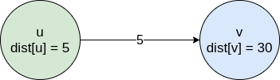
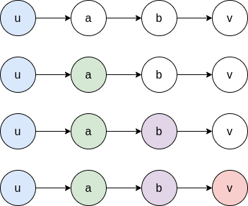
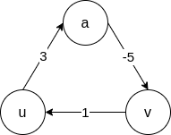
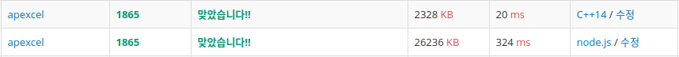

## 벨만-포드 알고리즘(Bellman-Ford Algorithm)

벨만-포드 알고리즘은 알고리즘의 제안은 Alfonso Shimbel이 먼저 제시하였지만 [Richard Bellman](https://en.wikipedia.org/wiki/Richard_E._Bellman)과 [Lester Ford](https://en.wikipedia.org/wiki/L._R._Ford_Jr.)가 이후 각각 이 알고리즘을 발표하여 둘의 이름을 따와서 붙이게 되었다. 이 알고리즘은 **음의 가중치는 허용하지만 가중치의 합이 음인 사이클은 허용하지 않는 것**이 다익스트라 알고리즘과 차이점이다. 사이클의 합이 음수인 경우가 존재하는 경우 이를 발견하여 알려 줄 수 있다.

## 동작 과정과 원리

알고리즘의 시작시 시작점부터 시작점까지의 거리가 `0`인 것과 다른 나머지 원소들은 `INF`로 초기화된 것 이외에는 정보가 없다. 벨만-포드 알고리즘은 최단 거리의 상한을 예측하고 실제 최단 거리 사이의 오차를 반복적으로 줄여가는 식으로 동작하는데 이 때 다음과 같은 최단 거리의 특성을 이용한다.

> $dist[v] \leq dist[u] + w(u, v)$

이를 아래의 그림을 통해 알아보면 `u`에서 `v`로 가는 간선의 가중치는 `5`이고  `u`까지 오는 최단거리는 `5`인데 `v`까지의 최단 경로는 `30`이다. 이는 모순이 되는 것이 `dist[u] + w(u, v)`는 `10`이므로 최단 거리 `dist[v]`는 `10`보다 클 수 없다.



`u`까지 오는데 걸리는 거리는 항상 `dist[u]` 보다 작거나 같고 따라서 `dist[v]`는 `dist[u] + w(u, v)`라 할 수 있다. `dist`가 점자 줄어드는 이러한 과정을 `(u ,v)`에 대해 **완화(relax)**한다고 한다. 이 단어도 동적 프로그래밍과 같이 수학 분야에서 가져온 것이라고 한다.



정점 `u`부터 정점 `v`에 이르는 최단 거리가 위 그림과 같다고 할 때 모든 간선에 대해 완화를 하게 되면 `(u, a)`에 대한 완화가 이루어진다. 그렇게 되면 `dist[a] <= dist[u] + w(u, a)`가 성립하게 된다. 근데 `dist[u] = 0` 이므로 `dist[a] <= w(u, a)`가 된다. `w(u, a)`는 `u`에서 `a`로 가는 최단 경로가 되어야 하는데 그렇지 않으면 최단 경로가 아니기 때문에 모순이 된다.

1. $dist[u] = 0$
2. $dist[a] \leq w(u, a)$
3. $dist[b] \leq dist[a] + w(a, b)$
4. $dist[v] \leq dist[b] + w(b, v)$

최종적으로 모든 간선에 대해 완화하는 작업을 $n$번하게 되면 $n$개 이하의 간선을 사용하는 최단 경로를 모두 찾을 수 있다. 따라서 모든 간선이 완화가 실패할 때 까지 반복하면 최단 경로를 찾을 수 있다. 음수 사이클이 없는 경우 최단 거리는 최대 $V - 1$개의 간선만 있으면 되므로 모든 간선에 대한 완화 과정은 $V - 1$이면 충분하다.

## 음수 사이클

그래프에 음수 사이클이 존재하는 경우 최단 거리 문제는 제대로 해결할 수 없다. 벨만-포드 알고리즘도 **음수 가중치를 허용**하는 것일 뿐 음수 사이클이 존재하는 경우 최단 거리를 구할 수 없다. 다만 음수 사이클이 존재하는지에 대한 여부를 판별하도록 하여 오류를 던지도록 할 수 있다.

음수 사이클이 존재 여부를 파악하려면 $V - 1$번 모든 간선에 대해 완화를 시도하는 대신 $V$번 완화를 시도하면 된다. 그래프에 음수 사이클이 없다면 $V - 1$의 수행으로 최단 거리를 찾아내기 때문에 마지만 반복의 완화는 실패하게 된다. 만약 음수 사이클이 존재한다면 $V$번째 반복에서도 완화가 한 번은 성공하게 된다.



1. $dist[a] \leq dist[u] + 3$
2. $dist[v] \leq dist[a] - 5$
3. $dist[u] \leq dist[v] + 1$
4. $dist[a] + dist[v] + dist[u] \leq dist[u] + dist[a] + dist[v] -1$
5. $0 \leq -1$

위와 같은 음수 사이클이 존재 할 때 모든 간선에 대해 완화가 실패하면 위 부등식이 성립해야만 한다. 그러나 식에 모순이 있으므로 어느 간선 하나에서는 완화가 발생하게 된다.

## 구현 1

```js
const V = 8, E = 14;
const INF = 987654321;
const g = Array.from(Array(V + 1), () => Array());

const data = [
    [1, 2, 8],
    [1, 3, 9],
    [1, 5, 11],
    [2, 4, 10],
    [3, 2, -15],
    [3, 4, 1],
    [3, 5, 3],
    [4, 8, 2],
    [5, 6, 8],
    [5, 7, 8],
    [6, 7, -7],
    [7, 3, 12],
    [7, 8, 5],
    [8, 6, 4]
];

for (let i = 0; i < data.length; i += 1) {
    const [from, to, weight] = data[i];
    g[from].push([to, weight]);
}

const BellmanFord = (graph, begin) => {
    const dist = Array(V + 1).fill(INF);
    let update;

    dist[begin] = 0;
    // 정점 순회
    for (let iter = 1; iter <= V; iter += 1) {
        update = false;
        // 간선들을 순회
        for (let curr = 1; curr <= V; curr += 1) {
            for (let i = 0; i < graph[curr].length; i += 1) {
                const [next, weight] = graph[curr][i];
                if (dist[next] > dist[curr] + weight) {
                    dist[next] = dist[curr] + weight;
                    update = true;
                }
            }
        }
        if (!update) break;
    }
    // 음수 사이클이 존재하는 경우
    if (update) {
        console.log('Negative cycle exist!');
        return;
    }
};
```

가장 바깥은 `for`문은 $V$번 순회하면서 모든 노드를 방문하고 내부의 두 개의 `for`문은 모든 간선을 순회한다. 만약 순회도중 해당 노드에 이르는 `dist`의 값이 기존의 도달하는 최단 경로의 값보다 작다면 교체해주고 교체했다는 것을 표시해준다. 만약 모든 간선에 대해 완화가 실패한다면 바로 종료하고 $V$번째 순회에서 완화가 성공한다면 음수 사이클이 존재한다는 것이므로 이를 알려주고 종료한다.

## 구현 2

```js
const V = 8, E = 14;
const INF = 987654321;
const g = [
    [1, 2, 8],
    [1, 3, 9],
    [1, 5, 11],
    [2, 4, 10],
    [3, 2, -15],
    [3, 4, 1],
    [3, 5, 3],
    [4, 8, 2],
    [5, 6, 8],
    [5, 7, 8],
    [6, 7, -7],
    [7, 3, 12],
    [7, 8, 5],
    [8, 6, 4]
];

const BellmanFord2 = (graph, begin) => {
    const dist = Array(V + 1).fill(INF);
    dist[begin] = 0;

    for (let i = 1; i <= V; i += 1) {
        for (let j = 0; j < graph.length; j += 1) {
            const [from, to, weight] = graph[j];
            if (dist[to] > dist[from] + weight) {
                dist[to] = dist[from] + weight;
            }
        }
    }
    // 음수 사이클이 존재하는 경우
    for (let k = 0; k < E; k += 1) {
        const [from, to, weight] = graph[k];
        if (dist[to] > dist[from] + weight) {
            console.log('Negative cycle exist!');
            return false;
        }
    }
    return true;
};
```

모양새만 조금 다를뿐 자세히 살펴보면 같은 첫 번째 구현과 동작 방식이 같다. 3중 `for`문을 쓰느냐 간선에 대한 탐색 부분을 바깥으로 따로 빼느냐의 차이점 정도가 있다.

## 시간 복잡도

$V$번 순회하는 `for`문과 간선들을 탐색하는 내부의 두번의 `for`문으로 전체 시간복잡도는 $O(VE)$가 된다.

> $O(VE)$

## 결과



백준 [웜홀](https://www.acmicpc.net/problem/1865)문제에 대한 결과이다. JS로 풀다가 수십번 틀렸는데 원인을 파악하지 못하고 C++로 풀다가 보니 JS에서 `dist`의 값을 초기화할 때 `Infinity`를 사용해서 계속 틀렸던 것이다. 적당히 큰 값을 이용해야 값이 변동 되었을 때 비교할 수 있는데 그렇지 못해서 계속 틀렸던 것이다. 이후 `Infinity`에서 적당히 큰 상수값으로 변경하여 문제를 해결했다.

## 참조(Refernces)

- 문병로, *쉽게 배우는 알고리즘: 관계 중심의 사고법*, (한빛 아카데미, 2018).
- 구종만, *알고리즘 문제 해결 전략*, (인사이트, 2012).
- "벨먼-포드 알고리즘", *Wikipedia*, https://ko.wikipedia.org/wiki/%EB%B2%A8%EB%A8%BC-%ED%8F%AC%EB%93%9C_%EC%95%8C%EA%B3%A0%EB%A6%AC%EC%A6%98.