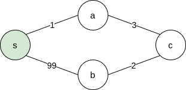
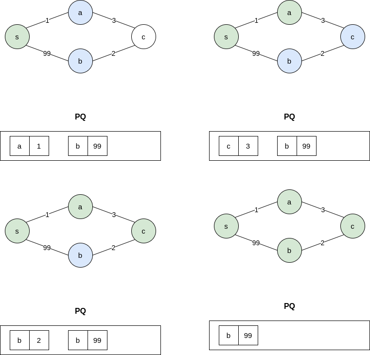
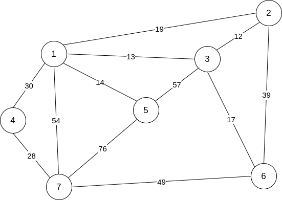
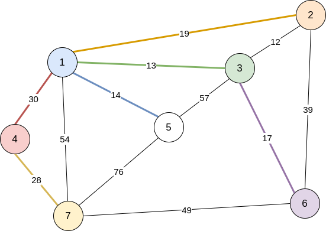

## 다익스트라 알고리즘(Dijkstra's Algorithm)

최단 거리를 구하는 방법 중 가장 유명한 알고리즘이라고 할 수 있는 다익스트라 알고리즘은 [Edsger Dijkstra](https://ko.wikipedia.org/wiki/%EC%97%90%EC%B8%A0%ED%97%88%EB%A5%B4_%EB%8D%B0%EC%9D%B4%ED%81%AC%EC%8A%A4%ED%8A%B8%EB%9D%BC)가 고안했으며 시작 정점을 제외한 다른 모든 정점에 이르는 최단 경로를 구하며 **음의 가중치를 허용하지 않는다.**



다익스트라의 알고리즘은 BFS와 유사한 형태로 시작점에서 가까운 순서로 정점을 방문한다. 일례로 위 그림에서 BFS로 탐색을 한다면 시작점에서 가까운 정점부터 탐색을 하기 때문에 `s-a-b-c`가 되지만 실제로는 `s-a-c-b`가 최단경로가 된다. 나중에 방문한 정점의 간선의 가중치가 더 작을 수 있기 때문에 이 문제를 해결하기 위해 다익스트라 알고리즘은 큐(queue) 대신 **우선 순위 큐(priority queue)**를 이용한다.

BFS에서는 큐에 인접한 정점을 추가했다면 다익스트라에서는 찾아낸 해당 정점까지의 최단거리를 쌍으로 넣는다. 우선 순위 큐는 정점까지의 최단 거리를 기준으로 정점의 순서를 정렬하고 방문하지 않은 정점 중 시작점으로부터의 거리가 가장 가까운 정점을 찾게 해준다.



위의 그림으로 예시를 들면 우선 순위 큐에 변화를 보면 정점 `c`와 정점 `b`가 연결될 때 기존의 `s`에서 `b`로가는 거리보다 짧다. 이 경우 우선 순위 큐에 남아 있는 `(b, 99)`을 처리해야 하는데 다음과 같은 방법을 이용한다.

- 우선 순위 큐에서 `(b, 99)`를 `(b, 6)`으로 바꾼다.
- `(b, 99)`가 큐에서 나올 때 무시한다.

전자는 구현도 어렵고 대부분의 STL에서 지원지 않으므로 보통은 후자의 방법을 많이 쓴다. 이 경우 이미 존재하는 최단 경로의 길이 보다 크다면 무시하면 된다.

## 구현

다익스트라의 원래 알고리즘은 $O(V^2)$의 시간복잡도를 가지지만 우선 순위 큐를 이용하면 $O(ElogV)$에 해결할 수 있다. 여기서는 우선 순위 큐를 이용한 방법을 토대로 구현해보았다.

```js
const Dijkstra = (graph, begin) => {
    const pq = new MinHeap(null);
    const dist = Array(V + 1).fill(Infinity);
    dist[begin] = 0;
    pq.insert([begin, 0]);

    while (pq.heap.length > 0) {
        const [node, weight] = pq.pop();
        if (dist[node] < weight) continue;

        for (let i = 0; i < graph[node].length; i += 1) {
            const [nextNode, nextWeight] = graph[node][i];
            if (dist[nextNode] > weight + nextWeight) {
                dist[nextNode] = weight + nextWeight;
                pq.insert([nextNode, weight + nextWeight]);
            }
        }
    }
    return dist;
};
```

먼저 이진 힙을 이용해서 우선 순위 큐를 구성하고 각 정점들까지의 최단 거리를 담는 `dist` 배열을 시작 정점을 제외하고 `Infinity`로 초기화 해주었다. 이후 우선 순위 큐도 시작 정점에 대해 초기화를 해준다.

이후 우선 순위 큐에 원소들이 남아 있을 동안 반복을 진행하며 만약 현재 추출한 `[정점, 가중치]` 쌍이 가진 가중치가 기존의 최단 거리보다 크다면 무시하고 그렇지 않다면 계속해서 진행한다.

현재 정점에 인접한 정점들을 탐색하여 대상 정점이 갖는 기존의 최단 거리보다 현재 정점으로 오는 가중치와 다음 정점으로 향하는 가중치의 합이 더 작다면 그 값으로 대체하고 우선 순위 큐에 `[정점, 새로운 가중치]` 쌍의 형태로 넣어준다.

참고로 모양새가 **프림 알고리즘(Prim's algorithm)**과 비슷하게 생겼다. 최소 신장 트리나 프림에 관련된 것은 이 [포스트](https://www.apexcel.blog/algorithm/graph/mst/mst/#prims-algorithm)에서 확인할 수 있다.



위와 같은 그래프를 `5`번 정점을 시작 정점으로 정하고 다익스트라를 통해 최단 거리를 구해 보면 다음과 같은 결과가 나온다.




## 시간 복잡도 분석

- 각 정점은 한 번씩 방문되고 각 정점에 인접한 간선들에 대해 한 번씩 검사하므로 $O(E)$가 걸릴 수 있다.
- 우선 순위 큐에 들어갈수 있는 최대 원소의 크기는 $E$이며 우선 순위 큐를 수선하는 작업은 $O(logE)$ 이므로 모든 원소에 대해서 해당 작업을 반복한다면 $O(ElogE)$가 될 수 있다.

> $O(E × logE)$

중복 원소를 우선 순위 큐에 넣지 않도록 하여 $O(VlogV)$에 수행 가능하다고 한다. 그러나 실제로는 구현의 복잡도나 오버헤드때문에 잘 쓰지 않는다고 한다.

## 결과


백준 [최단경로](https://www.acmicpc.net/problem/1753) 문제의 결과이다.

## 참조(References)

- 문병로, *쉽게 배우는 알고리즘: 관계 중심의 사고법*, (한빛 아카데미, 2018).
- 구종만, *알고리즘 문제 해결 전략*, (인사이트, 2012).
- "Dijkstra's Algorithm", *Wikipedia*, https://en.wikipedia.org/wiki/Dijkstra%27s_algorithm/.