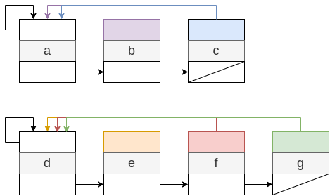
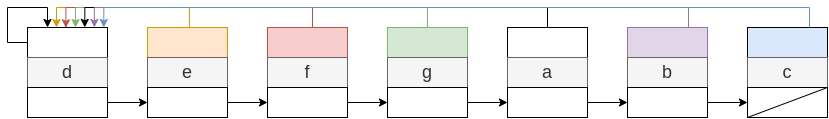
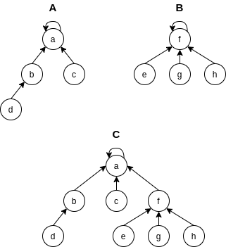
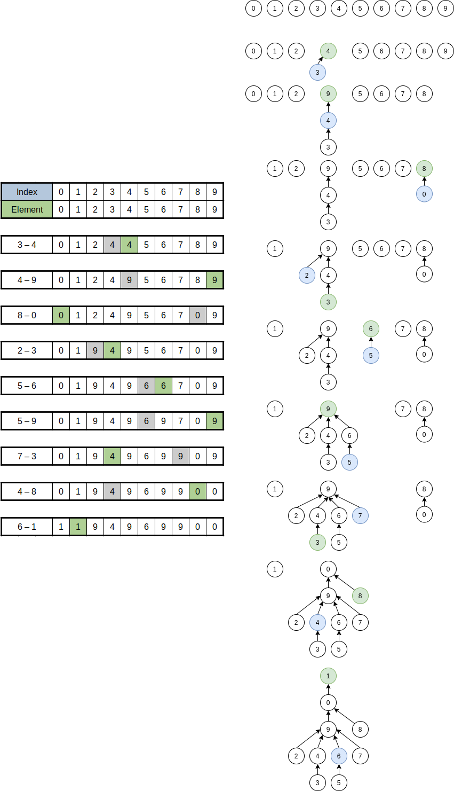
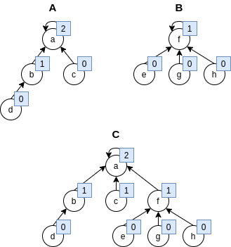
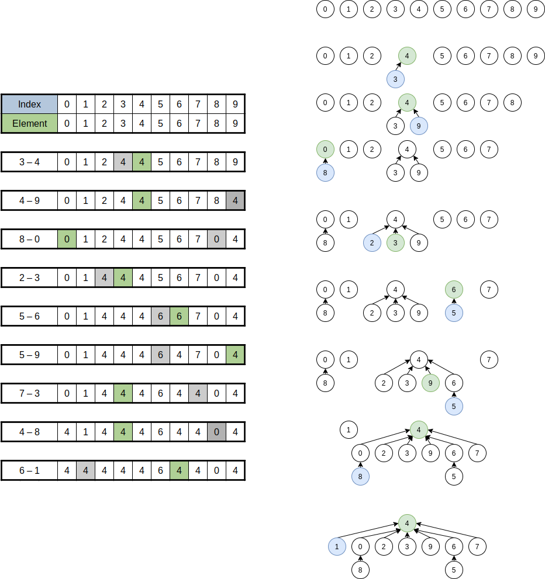
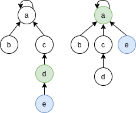

## 유니온-파인드

`유니온-파인드(union-find)`는 트리형 자료 구조의 일종으로 일반적인 트리의 형태와는 조금 다르다. 상호 배타적인 집합을 다루기 때문에`서로소 집합(disjoint set)`라고도 한다. 상호 배타적이기 때문에 두 집합의 교집합은 공집합이기 때문에 교집합연산은 필요없다. 해당 자료구조에서 필요한 연산은 다음 3가지이다.

- $MakeSet(x)$: 원소 $x$를 집합으로 만든다.
- $Find(x)$: 원소 $x$를 가진 집합을 찾는다.
- $Union(x, y)$: 두 원소 $x$와 $y$를 하나의 집합으로 만든다.

## 연결리스트로 구현



`{a, b, c}`를 원소로 가지는 집합 `A`와 `{d, e, f, g}`를 원소로 가지는 집합 `B`가 있다. 각 집합이 속하는 대표 원소를 향하는 포인터와 같은 집합에 속하는 다음 원소의 주소를 가리키는 포인터가 하나씩 있다. 만약 다음 노드가 없다면 `NIL`을 가리키면 된다.



두 집합 `A`와 `B`를 합치는 `union` 연산을 할 때 큰 집합에 작은 집합을 이어 붙이면 된다. 당연하게도 작은 집합의 원소 개수가 더 적기 때문에 대표 원소로 포인터를 옮기는 작업이 적기 때문이다. 작은 집합의 대표 원소의 포인터를 큰 집합의 대표 원소의 주소를 가리키게 하고 큰 집합의 마지막 노드의 다음 노드를 작은 집합의 대표 원소를 가리키면 된다. 이와 같은 방법은 `무게를 고려한(weighted) union`이라한다.

이 방법에서 시간 복잡도는 `makeSet`과 `find`연산은 $O(1)$에 가능하고 `weighted union`연산 중 `m`번의 `makeSet`, `union,`, `find` 연산을 수행 할 때 `n`번이 `makeSet`이라면 $O(m + nlogn)$에 가능하다.

## 트리로 구현

연결 리스트로 구현하는 것보다 더욱 효율적인 방법이 있는데 각 집합을 하나의 트리로 구현하는 것이다. 일반적인 트리의 경우 부모 노드가 자식 노드를 가리키지만 여기서는 자식 노드가 부모 노드를 가리킨다. 하나의 원소를 가지는 집합에 대해 노드를 만들고 부모 노드가 있는 경우 부모 노드를 가리키고 없는 경우 스스로를 가리킨다.

### Naive Disjoint Set



두 집합 `{a, b, c, d}`와 `{e, f, g, h}`를 `union`할 경우 단순히 한 집합의 루트 노드의 부모를 다른 집합의 루트 노드로 변경해주면 된다. 이 때 두 원소가 같은 집합에 포함되는지 확인 하기 위해서는 트리의 루트 노드를 확인하면 된다. 따라서 트리에서 `find` 연산은 같은 루트 노드를 갖는지 확인하는 작업을 거치면 된다. `union`에서는 찾은 두 루트 노드 중 하나의 루트 노드를 다른 하나의 루트 노드를 가리키게 하면 된다.

```js
class DisjointSet {
    constructor() {
        this.set = [];
    }

    makeSet = n => {
        for (let i = 0; i < n; i += 1) {
            this.set[i] = i;
        }
    }

    find = u => {
        if (u === this.set[u]) return u;
        return this.find(this.set[u]);
    }

    union = (u, v) => {
        u = this.find(u), v = this.find(v);
        if (u === v) return;
        this.set[u] = v;
    }
}
```

- 초기화를 하는 `makeSet`에서는 각 노드가 스스로를 가리키도록 하는 과정이다.
- `find`는 찾고자 하는 원소의 값이 루트 노드인 경우 바로 반환하고 그렇지 않으면 부모 노드를 재귀적으로 호출한다.
- `union`은 합치고자 하는 두 노드의 루트 노드를 찾아서 한 루트 노드의 부모 노드의 주소를 다른 루트노드로 변경한다.

아래 그림은 해당 코드의 일련의 진행 과정을 나타낸 것으로 배열의 인덱스는 노드를 뜻하고 배열의 원소는 해당 노드의 부모 노드를 가리킨다. `3 - 4`의 뜻은 `union(3, 4)`와 같다.



### Weighted Union

앞선 구현에서는 `find`와 `union`을 실행하는 데 걸리는 시간은 트리의 높이에 비례한다. 다만 이 방법은 이진 트리와 같이 연산 순서에 따라 한쪽으로 편향된 트리의 모습이 될 수도있다. 이 해결책으로는 여러가지 방법이 있는데 그 중 하나가 항상 높이가 더 낮은 트리를 높이가 더 큰 트리 밑에 집어넣는 것이다.
이러한 최적화를 `weighted union`라 부른다. 각 노드가 자신을 루트로 하는 서브 트리의 높이를 `rank`라 부르고 단 하나의 노드로 된 트리의 경우 `rank`는 `0`이다.



각 노드에 랭크를 표시했다. 랭크가 1인 집합을 랭크가 2인 집합에 붙였고 랭크의 크기는 늘어나지 않았다. 랭크가 커지는 경우는 두 랭크가 같을 경우에만 늘어난다.

```js
    makeSet = n => {
        this.rank = [];
        for (let i = 0; i < n; i += 1) {
            this.set[i] = i;
            this.rank[i] = 0;
        }
    }

    union = (u, v) => {
        u = this.find(u), v = this.find(v);
        if (this.rank[u] > this.rank[v]) {
            this.set[v] = u;
        }
        else {
            this.set[u] = v;
            if (this.rank[u] === this.rank[v]) {
                this.rank[v] += 1;
            }
        }
    }
```

`weighted union`을 이용하기 위해 기존 코드에 몇 가지를 추가했다.

- `makeSet`에 랭크 값을 담는 배열을 `0`으로 초기화 해준다.
- `union` 실행시 `u` 의 랭크가 더 크다면 `v`를 `u`의 서브 트리로 추가한다.
- `v`가 더 크거나 같다면 `u`를 `v`의 서브 트리로 추가하고 둘의 랭크가 같다면 랭크 값을 증가 시킨다.



앞선 일반적인 `union-find`보다 트리의 높이가 낮아진 것을 확인할 수 있다. 높이가 `h`인 트리가 생기기 위해서는 `h-1`인 트리 2개가 합쳐져야 한다. `h`가 `1`이면 `0`인 노드 2개가 필요하고 `h`가 `2`이면 `h`가 `1`인 노드가 최소 2개는 필요하다. 따라서 `h-1`의 높이를 가지기 위해 `n`개의 노드가 필요하다면 `h`의 높이를 갖기 위해서는 최소 `2n`개의 노드가 필요하다. 즉, 높이가 `h`일 때 노드의 개수는 최소 $2^h$개 이므로 노드의 개수가 `n`개라면 $h = logn$이 된다. 따라서 탐색과 병합 연산은 $O(logn)$이 된다.

### Path Compression

다른 최적화 방법도 있는데, `weighted union`이 합치는 단계에서 시간을 절약한다면 `경로 압축(path compression)`은 탐색하는 과정에서 시간을 줄이는 방법이다.



`find(u)`를 통해 `u`가 속하는 루트 노드를 찾았을 때 `u`의 루트 노드를 바로 바꾸어 버리면 다음번에 경로를 탐색할 필요 없이 바로 루트 노드를 찾을 수 있게 된다.

```js
find = u => {
    if (u === this.set[u]) return u;
    return this.set[u] = find(this.set[u]);
}
```

기존 코드의 리턴 값에 위와 같이 추가 해주면 된다.

### Weighted Union with Path Compression

두 가지 최적화를 모두 적용한 경우, `n`개의 원소에 대해 `union-find`를 `m`번 수행했을 때 평균 시간 복잡도가 $O(mlog^*n)$이라고 한다.

> $log^*n = min(k | loglog...logn <= 1)$

$log^*n$은 $n$에 $log$를 계속 취할 때 `k`가 `1`이하가 된다는 뜻으로, [Ackermann fucntion](https://ko.wikipedia.org/wiki/%EC%95%84%EC%BB%A4%EB%A7%8C_%ED%95%A8%EC%88%98)와 관련이 있다. 간략히 말하면 다룰 수 있는 모든 수에 대해 5보다 작으며 평균적으로 상수 시간이 걸린다.

## 참조

- 문병로, (2018), 쉽게 배우는 알고리즘: 관계 중심의 사고법, 한빛 아카데미
- 구종만, (2012), 알고리즘 문제 해결 전략
- [Geeks for Geeks, Linked List representation of Disjoint Set Data Structures](https://www.geeksforgeeks.org/linked-list-representation-disjoint-set-data-structures/)
- [Algorithms, 4th Edition, Case Study: Union-Find](https://algs4.cs.princeton.edu/15uf/)
- [Wikipedia, Ackermann fucntion](https://ko.wikipedia.org/wiki/%EC%95%84%EC%BB%A4%EB%A7%8C_%ED%95%A8%EC%88%98)