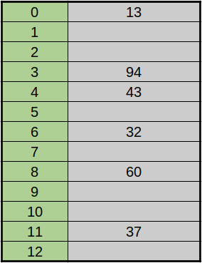

## 1. 해시

해시의 어원에 관해 찾아보니 `해시(hash)`는 고기나 채소등을 다져 요리한 것이라고 하는데 이는 프랑스어 [잘게 다져진(hache)](https://dict.naver.com/frkodict/#/entry/frko/0ea3595080d34603b3c9490736129a44)와 [잘게 베다(hacher)](https://dict.naver.com/frkodict/#/entry/frko/5fccc1d068f64632be854d27254d199f)에서 유래되었다고 한다.

<a href='https://www.google.com/search?q=origin+of+word+hash&source=lmns&bih=977&biw=1920&hl=ko&sa=X&ved=2ahUKEwie9N6gtc7uAhXlNKYKHT97AXUQ_AUoAHoECAEQAA'>출처</a>

다져진 재료들을 놓고 보면 원래의 형태가 어떤지 알 수가 없을 것이다. 마찬가지로 해시 함수에 의해 생성되는 해시 값들은 계산적으로 충돌을 찾아내는 것이 불가능 해야한다. 해시는 결국 입력 값이 같으면 항상 같은 값을 뱉어내기 때문에 암호학적으로 역 해시가 가능하다면 값을 찾아낸 것이 가능하기 때문이다.

## 2. 해시 함수

`해시 함수(hash function)`는 임의의 길이의 데이터를 고정된 길이의 데이터로 매핑하는 함수이다. 이 함수에 의해 변환된 값들을 해시 값 또는 해시 코드라고 한다. 해시 함수를 $h$, 변환 될 키 값을 $k$, 함수를 이용해 계산된 값을 $x$라 하면 다음과 같이 나타낼 수 있다.

> $h(k) = x$

또 여러개의 특징이 있지만 중요한 것만 고르자면 다음과 같다.

- 입력 값이 같으면 출력 값도 같다.
- 고정된 길이의 반환 값을 가져야 한다.
- 출력 값을 토대로 입력 값을 계산할 수 없어야 한다.

따라서 이를통해 해시 함수에 의해 나온 해시 값이 동일하다면 데이터에 대한 무결성을 보장할 수 있다. 예를 들면 인터넷에서 어떠한 파일을 다운로드 받을 때 그것이 정상적인 파일인지 확인할 때 쓰이며 주로 블록체인이나 암호학 그리고 아래의 해시 테이블과 관련하여 사용된다.

## 3. 해시 테이블

`해시 테이블(hash table)`은 효율적인 자료구조로서 평균적으로 상수시간내에 삽입, 삭제, 검색을 실행할 수 있다. 원소가 저장될 공간의 위치가 원소의 값에 의해 정해지는 자료구조이다. 따라서 저장된 자료와 비교하지 않고 바로 저장될 공간의 위치를 알 수 있으므로 일반적으로 탐색, 삽입, 삭제의 시간이 $O(1)$이고 최악의 경우 $O(n)$이다.

해시 테이블을 만들려면 해시 함수가 필요하다. 해쉬 테이블에 사용될 함수를 만드는데에는 크게 두 가지 방법이 있다. 하나는 `나누기 방법(modulo method)`이고 다른 하나는 `곱하기 방법(multiplication method)`이 있다.

### 3.1. 나누기 방법

나누기 방법은 다음과 같은 형태의 함수이다.

> $h(x) = x$ $mod$ $m$

해시 함수가 `$h(x) = x$ $mod$ 17$`일 때 크기가 17인 해시 테이블에 `[11, 94, 55, 37, 17]` 순서로 들어간다고 하면 다음과 같은 그림형태가 된다. 키로 들어온 값을 17로 나눈 나머지가 테이블의 인덱스가 되고 그 곳에 값을 저장하면 된다. 키 값 `37`을 검색 한다면 `h(37)`에 값이 존재하는지만 확인하면 된다. 

여기서 `m`은 `0`부터 `m-1`까지의 값을 가지기 때문에 테이블의 크기로 나눈 나머지 연산을 사용하는 것이 자연스럽다. 해시 테이블의 크기는 2의 제곱수와 가깝지 않은 수를 선택하는 것이 좋은데 $m=2^p$ 이라면 입력원소의 하위 p비트에 의해 해시 값이 결정되기 때문이다.
$m=2^4$이라할 때 23과 7이 순서대로 들어오면 똑같이 이진수로 `111` 값을 갖는다. 따라서 밀집도 높게 분포하는 것 보다 다양하게 분포하게 하는 해시 함수가 좋은 함수라 할 수 있다.

### 곱하기 방법

곱하기 방법은
### 적재율

일반적으로 해시 테이블은 하나의 1차원 배열로 만드는 데 해시 테이블에 자료가 얼마나 저장되어 있는가에 따라 해시 테이블의 성능에 큰 영향을 미치게 된다. 이 때 전체 공간 중 저장된 공간의 비율을 `적재율(load factor)`라 한다.

- `n` = 테이블에 있는 원소의 수
- `m` = 해시 테이블의 크기

> α = $\frac n{m}$

따라서 앞 선 테이블의 적재율을 계산하면 $\frac 5{16}$이 된다. 이 테이블의 적재율은 약 30% 정도지만 계속해서 값이 들어올 경우 필연적으로 같은 해시 값이 나올 것이고 이 때의 상황을 `충돌(collision)`이라한다. 적재율은 50%가 적당하며 임계 수준까지 다다르면 크기를 2배로 늘이거나 줄여서 다시 해싱을 한다.

## 해시의 충돌

해시 테이블의 문제는 두 개 이상의 키가 동일한 위치로 해시 값이 결정 되는 경우, 즉 서로 다른 키 $k_{1}$과 $k_{2}$가 동일한 해시 값을 가지는 문제가 발생하는데 이를 `충돌(collision)`이라고 한다. 이를 얼마나 잘 처리하느냐가 해시 테이블의 핵심이라 할 수 있다. 이를 해결 하는 대표적 방법으로 `chaining`과 `open addressing`이 있다.

### Chaining

체이닝의 경우 `연결 리스트(linked-list)`를 이용해서 새로운 노드를 생성해서 충돌한 값의 맨 앞에 추가한다.

### Open Addressing

- 모든 키를 해시 테이블 자체에 저장
- 테이블의 각 칸(slot)에는 1개의 키만 저장
- 해결 기법
    1. Linear probing
    2. Quadratic probing
    3. Double hashing
    4. ETC.

#### Linear probing

$h(k)$, $h(k)+1$, $h(k)+2$, ... $h(k)+n$ 순서로 검사하여 처음으로 빈 슬롯에 저장하는 것. 테이블의 끝에 도달하면 처음 슬롯부터 돌아가며 circular하게 작동한다.

- 장점
    - ?
- 단점
    - primary cluster - key 값들이 분산되어 있지 않고 밀집 되어 있는 경우가 많다.

#### Quadratic probing

충돌이 발생시 $h(k)+1^2$, $h(k)+2^2$, $h(k)+2^2$, ... 순서로 시도하는 것.

#### Double hashing
서로 다른 두 해시 함수 $h_1$과 $h_2$를 이용하여 충돌이 생긴 경우 다른 해시 함수를 이용하는 방식이다.

#### 키의 삭제

linear probing으로 같은 해시 값을 갖는 키 값 일부를 삭제하면 문제가 생긴다.
