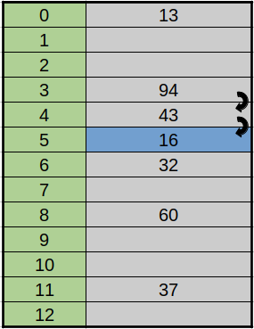

## 1. 해시

해시의 어원에 관해 찾아보니 `해시(hash)`는 고기나 채소등을 다져 요리한 것이라고 하는데 이는 프랑스어 [잘게 다져진(hache)](https://dict.naver.com/frkodict/#/entry/frko/0ea3595080d34603b3c9490736129a44)와 [잘게 베다(hacher)](https://dict.naver.com/frkodict/#/entry/frko/5fccc1d068f64632be854d27254d199f)에서 유래되었다고 한다.

<a href='https://www.google.com/search?q=origin+of+word+hash&source=lmns&bih=977&biw=1920&hl=ko&sa=X&ved=2ahUKEwie9N6gtc7uAhXlNKYKHT97AXUQ_AUoAHoECAEQAA'>출처</a>

다져진 재료들을 놓고 보면 원래의 형태가 어떤지 알 수가 없을 것이다. 마찬가지로 해시 함수에 의해 생성되는 해시 값들은 계산적으로 원래의 값을 찾아내는 것이 불가능 해야한다. 해시는 결국 입력 값이 같으면 항상 같은 값을 뱉어내기 때문에 암호학적으로 역 해시가 가능하다면 값을 찾아낸 것이 가능하기 때문이다.

## 2. 해시 함수

`해시 함수(hash function)`는 임의의 길이의 데이터를 고정된 길이의 데이터로 매핑하는 함수이다. 이 함수에 의해 변환된 값들을 해시 값 또는 해시 코드라고 한다. 해시 함수를 $h$, 변환 될 키 값을 $k$, 함수를 이용해 계산된 값을 $x$라 하면 다음과 같이 나타낼 수 있다.

> $h(k) = x$

또 여러개의 특징이 있지만 중요한 것만 고르자면 다음과 같다.

- 입력 값이 같으면 출력 값도 같다.
- 고정된 길이의 반환 값을 가져야 한다.
- 출력 값을 토대로 입력 값을 계산할 수 없어야 한다.

따라서 이를통해 해시 함수에 의해 나온 해시 값이 동일하다면 데이터에 대한 무결성을 보장할 수 있다. 예를 들면 인터넷에서 어떠한 파일을 다운로드 받을 때 그것이 정상적인 파일인지 확인할 때 쓰이며 주로 블록체인이나 암호학 그리고 아래의 해시 테이블과 관련하여 사용된다.

## 3. 해시 테이블

`해시 테이블(hash table)` 혹은 `해시 맵(hash map)`은 효율적인 자료구조로서 평균적으로 상수시간내에 삽입, 삭제, 검색을 실행할 수 있다. 원소가 저장될 공간의 위치가 원소의 값에 의해 정해지는 자료구조이다. 따라서 저장된 자료와 비교하지 않고 바로 저장될 공간의 위치를 알 수 있으므로 일반적으로 탐색, 삽입, 삭제의 시간이 $O(1)$이고 최악의 경우 $O(n)$이다.

해시 테이블을 만들려면 해시 함수가 필요하다. 해쉬 테이블에 사용될 함수를 만드는데에는 크게 두 가지 방법이 있다. 하나는 `나누기 방법(modulo method)`이고 다른 하나는 `곱하기 방법(multiplication method)`이 있다.

### 3.1. 나누기 방법

나누기 방법은 다음과 같은 형태의 함수이다.

> $h(x) = x \mod m$

- `x` = 입력 원소
- `m` = 테이블 크기

해시 함수가 $h(x) = x \mod 13$일 때 크기가 `17`인 해시 테이블에 `[60, 32, 94, 43, 13, 37]` 순서로 들어간다고 하면 다음과 같은 그림형태가 된다. 키로 들어온 값을 13로 나눈 나머지가 테이블의 인덱스가 되고 그 곳에 값을 저장하면 된다. 키 값 `37`을 검색 한다면 $h(37)$에 값이 존재하는지만 확인하면 된다.

여기서 `m`은 `0`부터 `m-1`까지의 값을 가지기 때문에 테이블의 크기로 나눈 나머지 연산을 사용하는 것이 자연스럽다. 해시 테이블의 크기는 2의 제곱수와 가깝지 않은 수를 선택하는 것이 좋은데 $m=2^p$ 이라면 입력 원소의 하위 p비트에 의해 해시 값이 결정되기 때문이다.
$m=2^4$이라할 때 `23(10111)`과 `7(111)`이 들어오면 하위 4비트가 똑같이 이진수로 `111` 값을 갖는다. 따라서 다양하게 분포하게 하는 해시 함수가 좋은 함수라 할 수 있다.

### 3.2. 곱하기 방법

곱하기 방법은 다음과 같은 형태의 함수이다.

> $h(x) = \lfloor m (Cx \mod 1) \rfloor$

- `x` = 입력 원소
- `C` = 0에서 1사이의 상수
- `m` = 테이블 크기

곱하기 방법은 나누기 방법은 반대라고 할 수 있다. 이 방법에서는 입력값을 0과 1사이의 소수로 대응시켜서 해시 테이블의 크기 `m`을 곱하여 `0`부터 `m-1` 까지의 값을 만들어낸다.
`x`에 `C`를 곱하고 나온 값의 소수점 이하의 값과 `m`을 곱하여 `m`의 상수 부분만 취하면 그 값이 해시 값이된다. 

나누기 방법과 다르게 테이블의 크기는 아무렇게 잡아도 상관없으나 $2^p$ 단위로 잡는것이 컴퓨터 친화적일 것이다. `The Art of Computer Programming`을 집필한 [Donald Knuth](https://ko.wikipedia.org/wiki/%EB%8F%84%EB%84%90%EB%93%9C_%EC%BB%A4%EB%88%84%EC%8A%A4)는 이 상수 `C`를 $\frac{\sqrt{5}-1}{2}$로 잡는 것이 효율적이라고 제안하였다. 예시를 들면 입력 원소 `234`에 대해서는 다음과 같이 진행된다. 여기서 `m`은 `256`이고 `C`는 크누스가 제안한 값으로 약 `0.618033...`이다.

1. $234 × C ≒ 144.619722$
2. $256 × 0.619722 = 158.648832$
3. $h(x) = 158$

따라서 입력 원소 `234`는 인덱스 `158`에 위치하게 된다.

### 3.3. 적재율

일반적으로 해시 테이블은 하나의 1차원 배열로 만드는 데 해시 테이블에 자료가 얼마나 저장되어 있는가에 따라 해시 테이블의 성능에 큰 영향을 미치게 된다. 이 때 전체 공간 중 저장된 공간의 비율을 `적재율(load factor)`라 한다.

- `n` = 테이블에 있는 원소의 수
- `m` = 해시 테이블의 크기

> α = $\frac n{m}$

따라서 앞 선 테이블의 적재율을 계산하면 $\frac 5{16}$이 된다. 이 테이블의 적재율은 약 30% 정도지만 계속해서 값이 들어올 경우 필연적으로 같은 해시 값이 나올 것이고 이 때의 상황을 `충돌(collision)`이라한다. 적재율은 50%가 적당하며 임계 수준까지 다다르면 크기를 2배로 늘이거나 줄여서 원소 값들에 대해 다시 해싱을 한다.

## 4. 해시의 충돌

해시 테이블의 문제는 두 개 이상의 키가 동일한 위치로 해시 값이 결정 되는 경우, 즉 서로 다른 키 $k_{1}$과 $k_{2}$가 동일한 해시 값을 가지는 문제가 발생하는데 이를 `충돌(collision)`이라고 한다.

나누기 방법에서 예시를 들었던 테이블에 새로운 원소 `76`가 들어온다고 하면 기존 값 `37`의 해시 값과 새로운 값이 같은 주소 `11`를 가진다. 이 문제 얼마나 잘 처리하느냐가 해시 테이블의 핵심이라 할 수 있다. 이를 해결 하는 대표적 방법으로 `chaining`과 `open addressing`이 있다.

### 4.1. Chaining

체이닝의 경우 테이블의 각 요소를 `연결 리스트(linked-list)`를 이용해서 충돌이 발생 할 경우 새로운 노드를 생성해서 충돌한 값의 맨 앞에 추가한다. 맨 앞에 넣는 것이 효율적인데 연결 리스트에 매달린 요소가 많을 경우 마지막 요소까지 탐색해야 하기 때문이다. 맨 앞에 삽입할 경우에는 생성한 노드에 기존 주소값만 연결 해주면 되기 때문이다. 테이블의 크기가 `13`인 해시 테이블에 체이닝을 이용하여 충돌을 해결한 모습이다. 입력 값이 `[137, 7, 55, 39, 21, 54, 13, 76, 32, 98, 52, 16]` 순서로 저장된다고 하면 다음과 같은 모습이 된다. 가장 먼저 들어온 원소가 맨 뒤에 있기 때문에 순서는 연결 리스트를 거꾸로 뒤집으면 된다.

1. `137` → $h(137) = 7$
2. `7` → $h(7) = 7$ → 충돌 발생
3. 체이닝

7번 인덱스에 대해서 살펴보면 `137`의 해시 값은 `7`이 되고 이 는 7번 인덱스에 있는 연결 리스트 맨 앞에 추가된다. 그 다음 값으로 `7`의 해시 값은 `7`이다. 이 때 충돌이 발생 하였으므로 새로운 노드를 생성해 7번 인덱스의 맨 앞에 연결하면 된다. 체이닝은 적재율이 1이 넘어도 계속 사용할 수 있다.

### 4.2. Open Addressing

오픈 어드레싱은 체이닝과 다르게 저장 공간을 늘리지 않고 충돌이 발생한 경우 규칙을 통해 빈 공간을 찾을 때 까지 탐색하는데, 따라서 해시 함수를 통해 나온 값과 실제 데이터가 저장되는 주소가 같다는 보장이 없다. 다음은 오픈 어드레싱의 대표적인 3가지 방법이다.

1. 선형 조사(Linear probing)
2. 이차원 조사(Quadratic probing)
3. 이중 해싱(Double hashing)

#### 4.2.1. 선형 조사(Linear Probing)

충돌이 발생한 경우 충돌한 자리의 다음 값(혹은 $i$ 만큼의 크기)을 확인한다. 그 공간은 $h(x)$ 에서 $i$ 만큼 떨어져 있으므로 $h(x) + i$와 같이 나타낼 수 있다. 만약 해당 공간도 원소가 존재 한다면 빈 공간을 찾을 때 까지 탐색한다. 이렇게 탐색 하다가 $k$번째에서 빈 공간을 찾아내면 $h_{k}(x) + i$와 같이 나타내며, 다음과 같이 일반화 할 수 있다.

> $h_{k} = (h(x) + i) \mod m \\ i = 0, 1, 2, ...$

$i$가 1일 때라 가정하고 예시를 들어보면 다음과 같다. `[60, 32, 94, 43, 13, 37, 16, 55]` 순서로 입력 값이 들어온다고 한다면 $h(16)$의 값인 `3` 이지만 이미 `94`가 자리를 차지 하고 있으므로 $h(16) + 1$인 `4`로 이동한다. 그러나 `4`의 자리도 `43`이 차지하고 있으므로 그 다음 값인 `5`로 이동한다. 비어 있으므로 `h(16)`의 값은 `5`가 되었다.

마찬가지로 `55`가 주어질 때도 같다. $h(55)$의 값은 `3`이지만 이미 자리를 차지 하고 있으므로 같은 방법을 이용하여 빈 공간을 탐색하고 $h(55)$ 는 `7`이 된다.

위와 같은 방식으로 빈 공간을 탐색하며 테이블의 끝에 도달하면 처음으로 돌아간다. 선형 조사의 경우 특정 구간에 원소들이 몰리게 되는 현상이 있는데 이를 `1차 군집(primary clustering)`이라 하며 인덱스 `3`부터 `8`까지의 구간이 군집을 이룬 상황이다. 해당 구간에 상응하는 값이 들어오면 계속해서 군집의 크기가 확장되게 되므로 해시 테이블의 성능을 떨어뜨리게 된다.

선형 조사를 이용한 경우 삽입과 삭제를 반복하면 `A`는 `B`의 주소에 저장되고 `B`는 `C`의 주소에 저장되는 식으로 문제가 생길 가능성이 있다.

#### 4.2.2. 이차원 조사(Quadratic Probing)

선형 조사의 방법이 일차 함수 값만큼 크기를 늘려가며 탐색 했다면 이차원 조사에서는 이차 함수 값만큼 크기를 늘려가며 탐색한다.

> $h_{i}(x) = (h(x) + C_{1}i^2 + C_{2}i) \\ i = 0, 1, 2, ...$

이 방법은 군집을 이룬 구간을 빠르게 탈출 할 수 있다. 그러나 초기 해시 함수 값이 동일하면 `2차 군집(secondary clustering)`이라는 현상을 겪는데 `1차 군집`과 마찬가지로 특정 구간에 몰리는 현상을 말한다.

#### 4.2.3. 이중 해싱(Double hashing)

이중 해싱은 서로 다른 두 개의 함수를 이용해 해시 값을 구하고 아래와 같이 나타낼 수 있다.

> $h_{i}(x) = (h(x) + i ⋅ f(x)) \mod m \\ i = 0, 1, 2, ...$

이 방법은 충돌 발생시 두 번째 함수 $i ⋅ f(x)$ 만큼 건너뛰게 된다. 예시를 통해 확인해보면 아래의 그림과 같다.

- $h(x) = x \mod 13$
- $f(x) = 1 + (x \mod 7)$
- $h_i(x) = h(x) + i ⋅ f(x))$

`[15, 67, 41]` 순서로 입력이 들어온다고 한다면, $h_0(15)$의 값은 `2`, `67`의 경우 $h_0(67)$의 값이 `2`가 되어 충돌이 되므로 다음 $i$ 값인 1로 넘어가 $h_1(67)$의 경우 `7`이 된다. `41`도 $h_0(41)$의 값이 `2` 이므로 $h_1(41)$은 `9`가 된다.

두 개의 해시 함수를 정할 때 권장하는 것은 $h(x) = x \mod m$으로 잡고 `m` 보다 약간 작은 소수 `n`에 대해 $f(x) = 1 + (x \mod n)$ 로 정하는 것이다. 이렇게 하면 $h(x)$와 $h(y)$가 같아도 $f(x)$와 $f(y)$는 달라지기 때문이다.

## 5. 키의 삭제

위의 그림에서 선형 조사를 이용하여 해시 값을 구하였을 때, `1`의 값을 삭제하고 `26`을 탐색한다고 하자. `26`의 해시 값인 `0`을 탐색하고 그 다음인 `1`을 탐색하지만 값이 없으므로 `26`은 테이블내에 존재하지 않는다고 판단할 수 있다. 이럴 경우 값을 삭제한 뒤 해당 자리에 값이 존재 했었다고 표시(`DELETED`)를 해주면 된다. 새로운 값을 삽입할 경우에는 `DELETED` 상수를 제거하고 삽입하면 된다.

## 참조(References)

- 문병로, <i>쉽게 배우는 알고리즘: 관계 중심의 사고법</i>, (한빛 아카데미, 2018).
- "Hash Table", <i>Wikipedia</i>, (Access: Feb, 02, 2021), https://en.wikipedia.org/wiki/Hash_table.
- "Primary Clustering", <i>Wikipedia</i>, (Access: Feb, 02, 2021), https://en.wikipedia.org/wiki/Primary_clustering.