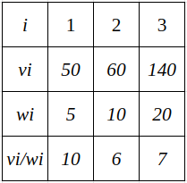
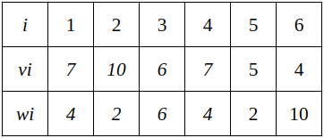
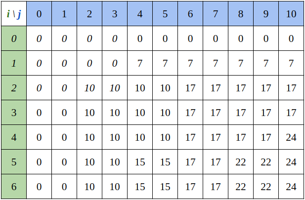
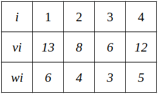
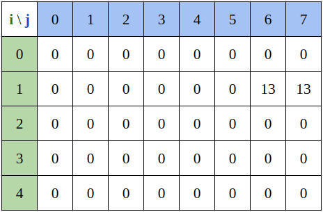
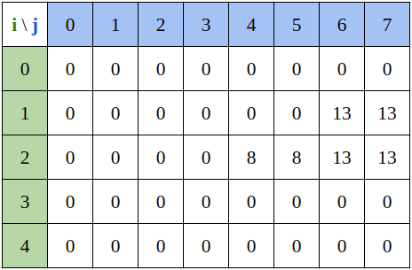

## 두 가지 유형

넣을 수 있는 용량이 $C$인 어떤 배낭(knapsack)이 있고 이 배낭들에 넣을 수 있는 $n$개의 물건들이 있다. 물건 $i$의 무게는 $W_i$이고 $V_i$만큼의 가치가 있다. 배낭의 넣은 물건들의 합이 $C$를 넘지 않으면서 가치가 최대로 될 수 있도록 배낭에 물건을 넣는 문제를 배낭 문제라고 한다.

배낭 문제는 두 가지 유형이 있는데 배낭에 넣는 물건을 쪼갤 수 있는 경우와 그렇지 않은 경우다. 쪼갤 수 있는 경우는 무게가 소수(decimal)일 수 있는 경우 이며 (물건이 금가루나 은가루라고 생각하면 된다) 이를 분할 가능한 배낭 문제(fractional knapsack problem)라고한다. 물건을 쪼갤 수 없는 경우 즉, 무게가 0 이상의 정수인 경우를 0-1 배낭 문제(0-1 knapsack problem)이라 한다. 쪼갤 수 있는 경우는 그리디 알고리즘으로 풀이가 가능하며 0-1 배낭문제는 동적계획법으로 풀이가 가능하다.

### 분할 가능한 배낭 문제(Fractional Knapsack Problem)

물건을 쪼갤 수 있기 때문에 이 경우에는 무게 대비 가치가 가장 큰 것을 먼저 선택한다.



배낭의 용량이 30일 때, 무게 대비 가치가 1번, 3번, 2번 물건순으로 높으므로 1번과 3번을 넣고 2번은 5만큼의 무게만 집어 넣으면 된다.

### 0-1 배낭 문제(0-1 Knapsack Problem)

0-1 배낭 문제의 경우 두 가지 경우가 있다. 배낭을 물건에 넣는 경우와 넣지 않는 경우이다. $n$개의 물건이 있을 때 $n$번 물건에 대한 선택에 대해 고려해봅시다.

```js
const weight = Array(n);
const value = Array(n); 
```

각 배열의 $n$번째 원소는 $n + 1$번 물건의 무게와 가치이다.

**1. 물건을 배낭에 넣지 않는 경우**

물건은 $n - 1$개가 남으며 배낭에 넣을 수 있는 최대 용량은 $C$이다. 가치는 변함이 없으며 $n - 1$개의 물건에 대해 $C$의 용량을 가진 배낭에 물건을 담는 부분 문제가 남는다.

**2. 물건을 배낭에 넣는 경우**

물건을 배낭에 넣으면 남은 물건은 $n-1$개가 되며 배낭에 넣을 수 있는 최대 용량은 `C - weight[n - 1]` 이며 배낭의 가치는 기존 가치에 `value[n - 1]`만큼 증가하며 $n - 1$개의 물건에 대해 `C - weight[n - 1]`만큼의 용량을 가진 배낭에 물건을 담는 부분 문제가 남는다.

#### 재귀

위 내용을 바탕으로 재귀적으로 구현하게 되면 다음과 같은데, 이 경우 각 노드가 2개의 자식 노드를 가지는 트리 형태가 되기때문에 중복해서 연산하는 경우가 생긴다. $O(2^n)$의 시간이 걸린다.

```js
const knapsack = (cap, idx) => {
    if (idx === N || cap <= 0) return 0;
    const [weight, value] = items[idx]; // items의 i번째는 weight[i - 1], value[i - 1]의 페어
    let ret = knapsack(cap, idx + 1); // 배낭에 담지 않는 경우

    if (weight <= cap) { // 배낭에 담을 수 있는 경우
        return Math.max(ret, knapsack(cap - weight, idx + 1) + value);
    }
    return ret;
};
```

#### 동적 계획법

일반적으로 동적 계획법에서 값을 결정하는 변수들의 차원만큼의 행렬에 대응하는 배열을 만들어 사용한다. 이 문제에는 무게와 가치 두 가지 변수가 있으므로 행과 열을 각 변수에 대입하여 만들고 행렬 $(i, w)$는 남아있는 물건 중 $i$번째까지의 물건을 용량 $w$의 배낭에 집어넣을 때의 최대 가치를 저장하면 된다.

```js
const dp = Array.from(Array(N + 1), () => Array(C + 1)) // Array[N + 1][C + 1]
```

$dp(i, w)$의 값, 현재 물건이 $i$이고 $w$만큼 용량에 담긴 배낭의 가치는 다음 두 가지 중 더 큰 값이다.

$dp[i][w]=\begin{dcases}
   max(dp[i - 1][w], value_i + dp[i - 1][w - w_i]) &\text{if } w_i <= w \\
   dp[i - 1][w] &\text{if } w_i > w
\end{dcases}$

**1. i번째 물건을 배낭에 넣지 않는 경우**

- `dp[i - 1][w]`
- $i$번째 물건을 배낭에 넣지 않았으므로 $i-1$번째 배낭의 가치를 그대로 가져온다.

**2. i번째 물건을 배낭에 넣는 경우**

- `dp[w - weight[i - 1]] + value[i - 1]`
- $i$번째 물건을 배낭에 넣기 위해서는 $w - weight[i - 1]$번째 무게 만큼의 용량이 배낭에 있어야 하므로 `dp[w - weight[i - 1]]`에서 계산한 값을 더해주면 된다.

```js
const dp = Array.from(Array(N + 1), () => Array(C + 1).fill(0));

const knapsack = () => {
    for (let i = 1; i <= N; i += 1) {
        const [weight, value] = items[i - 1];
        for (let w = 1; w <= C; w += 1) {
            dp[i][w] = dp[i - 1][w]; // 배낭에 담지 않는 경우
            if (weight <= w) { // 배낭에 담을 수 있는 경우
                dp[i][w] = Math.max(dp[i][w], dp[i - 1][w - weight] + value);
            }
        }
    }
    return dp[N][C];
};
```



$n = 6, C = 10$이고 물건들이 위와 같이 있을 때 이를 표로 나타내면 아래와 같다.



시간 복잡도는 $O(Cn)$이다

#### 개선된 알고리즘

$n$번째 행에서는 $dp[n][w]$만 계산하면 되기 때문에 $n - 1$번째 행에서는 $dp[n][w]$를 계산하는데에 필요한 구간만 계산하면 된다. $n - 1$번째 행에서는 $dp[n - 1][w], dp[n - 1][w - w_n]$만 가지고 $n$에서 부터 뒤로 연산을 진행하면 계산이 필요한 배열 값을 알 수 있다.

$dp[n][w]=\begin{dcases}
   max(dp[n - 1][w], value_n + dp[n - 1][w - w_n]) &\text{if } w_n <= w \\
   dp[n - 1][w] &\text{if } w_n > w
\end{dcases}$

```js
const dp = Array.from(Array(N + 1), () => Array(C + 1).fill(0));

for (let i = 1; i <= N; i += 1) {
    const [weight, value] = items[i - 1];
    for (let j = C; j >= 0; j -= 1) {
        dp[i][j] = dp[i - 1][j]
        if (j >= weight) {
            dp[i][j] = Math.max(dp[i][j], dp[i - 1][j - weight] + value);
        }
    }
}
```

$C = 7, n = 4$인 아래 표를 통해 확인해보자.





$dp[1][w]=\begin{dcases}
   max(dp[0][w], 13 + dp[0][w - 6]) &\text{if } 6 <= w \\
   dp[0][w] &\text{if } 6 > w
\end{dcases}$



$dp[2][w]=\begin{dcases}
   max(dp[1][w], 8 + dp[1][w - 4]) &\text{if } 4 <= w \\
   dp[1][w] &\text{if } 4 > w
\end{dcases}$


$dp(i, j)$ 행렬에서 $(i, j)$의 값을 구하고 나면 $(i - 1, j)$의 값이 필요없다는 것을 알 수 있다. 이를 통해 1차원 배열로 구성할 수도 있다.

$dp[w]=\begin{dcases}
   max(dp[w], value_n + dp[w - w_n]) &\text{if } w_n <= w \\
   dp[w] &\text{if } w_n > w
\end{dcases}$

```js
const dp = Array(C + 1).fill(0);

items.forEach(([w, v]) => {
    for (let i = C; i >= w; i -= 1) {
        dp[i] = Math.max(dp[i], dp[i - w] + v);
    }
});
```

## 참조(Reference)

- "배낭 문제", *Wikipedia*, https://ko.wikipedia.org/wiki/%EB%B0%B0%EB%82%AD_%EB%AC%B8%EC%A0%9C
- Richard Neapolitan, Kumarss Naimipour, *홍릉과학출판사*, 도경구 옮김, 알고리즘 기초(Foundation of Algorithm) 4th.
- Kamal Rawat, Meenakshi, *한빛미디어*, 박상은 옮김, 다이내믹 프로그래밍 완전 정복: 빠르고 우아한 상향식 문제 풀이법(Dynamic Programming for Coding Interviews: A Bottom-Up approach to problem solving) 1st.
