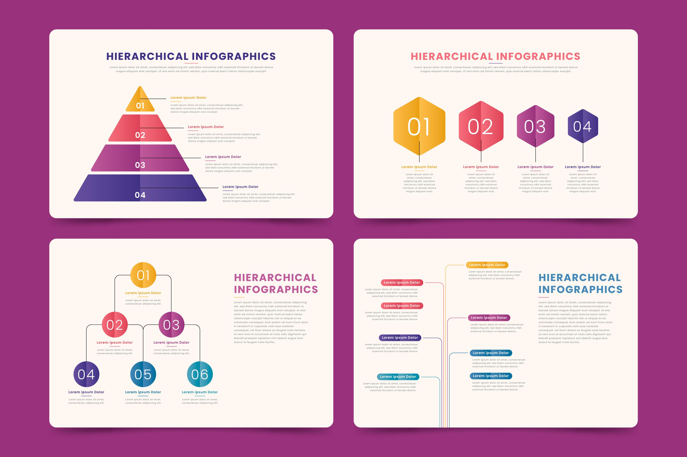

## 도입

`트리(Tree)`는 계층적 구조를 갖는 자료들을 나타내기 위한 자료구조이다. 계층적인 구조란 조직도나 대진표, 인사도와 같이 상하위 관계가 존재하는 것을 말한다.  다음의 그림과 같은 것들이 구조가 계층적 구조이다.
하나의 상위 개념에서 다시 하위 개념으로 뻗어 나가는 모습이 나무와 닮았는데 그래서 트리라는 이름이 붙었다고 한다.



### 트리의 기초적 용어의 정의

- `그래프(graph)`의 일종으로 `노드(node)`와 `간선(edge)`로 이루어져 있다.
- 최상위 노드를 `루트(root)`노드라고 하며 같은 계층의 노드는 `형제(sibling)`, 하위 노드는 `자식(child)`, 상위 노드는 `부모(parent)` 노드라고 한다.
- 부모 노드의 부모 노드는 `선조(ancestor)` 그리고 자식 노드의 자식들은 `자손(descendant)` 노드라고 한다.
- 단 하나의 루트 노드가 있고 각 노드는 하나의 부모 노드만을 갖는다.
- 자식이 하나도 없는 노드의 경우를 `잎새(leaf)` 노드라 한다.

### 트리의 속성

- 루트에서 임의의 노드에 도달하기 위한 간선의 수를 `깊이(depth)`라고 하는데 깊이가 클수록 트리의 하단에 위치해 있다.
- 루트에서 부터 트리의 최하단의 노드까지 해당 트리의 `높이(height)`라고 한다.

## 이진 검색 트리의 특징

이진 검색트리는 다음과 같은 특징이 있다.

> 1. 이진 검색 트리의 각 노드는 서로 다른 키 값을 하니씩 갖는다.
> 2. 단 하나의 루트노드가 있고, 각 노드는 최대 2개의 자식 노드를 갖는다.
> 3. 임의의 노드의 키 값은 자신의 왼쪽 노드에 있는 모든 노드의 키 값보다 크고, 오른쪽에 있는 모든 노드의 키 값보다 작다.

이러한 특징 때문에 `[1, 2, 3, 4, 5, 6]`과 같은 순서로 이진 검색 트리에 삽입을 하게 되면 오른쪽으로 치우진 형태의 트리가 형성된다. 또는 반대의 경우도 마찬가지이다. 이를 개선하기 위해 `k-진 검색 트리`, `RB-트리`, `B-트리`, `KD-트리`, `AVL-트리`, `R-트리` 등등 여러가지 트리가 존재한다. 그러나 일반적으로 정렬되지 않은 대부분의 데이터의 경우 어느정도 모양새가 잡힌 트리가 만들어진다.

## 이진 검색 트리에서 검색

트리에서의 검색은 해당 트리가 찾고자 하는 키를 가지고 있는지 아닌지 판별하는 것이다. 키 값 `key`를 찾을 때 `key`가 존재하면 `key`를 반환하고 아니면 `null` 을 반환하면 된다. 자바스크립트 코드로 나타내면 다음과 같다.

```js
class BSTNode {
    constructor(key) {
        this.key = key;
        this.left = null;
        this.right = null;
    }
}

class BST {
    constructor() {
        this.root = null;
    }

    contains(key) {
        const findNode = (node, key) => {
            if (node.key === key) {
                return node;
            }
            if (node.key > key) {
                return node.left ? findNode(node.left, key) : null;
            }
            if (node.key < key) {
                return node.right ? findNode(node.right, key) : null;
            }
            return null;
        };
        return findNode(this.root, key);
    }
}
```

먼저 이진 검색 트리의 노드 `BSTNode`와 이진 검색 트리 `BST`를 클래스로 선언하였다. `BST`의 메서드인 `contains`는 키 값을 받고 `findNode` 함수는 해당 트리의 루트부터 입력받은 키 값을 찾을 때 까지 재귀적으로 수행한다. 만약 해당 키를 가진 노드를 발견하면 노드를 반환하고 그렇지 않으면 `null`을 반환한다. 메서드는 다음과 같은 순서로 진행된다.

> 1. 루트로 부터 출발하여 해당 노드가 키 값과 일치한다면 노드를 반환.
> 2. 해당 노드의 키 값 보다 찾고자 하는 키 값보다 작다면 왼쪽 자식 트리로 이동.
> 3. 해당 노드의 키 값 보다 찾고자 하는 키 값보다 크다면 오른쪽 자식 트리로 이동.

이진 검색 트리의 성질에 의해 자기 자신보다 작은 노드들은 왼쪽에 위치하고 큰 노드들은 오른쪽에 위치하기 때문에 트리를 타고 내려가면서 분기에 따라 다시 서브 트리를 탐색한다.
결국 전체 트리에서 양쪽 서브 트리중 하나로 내려가며 원래의 문제인 `key` 값을 찾는 문제와 같으면서 크기는 작아진 문제를 만난다.

## 이진 검색 트리에서 삽입

```js
insert(key) {
    const node = new BSTNode(key);
    const innerInsert = (node, newNode) => {
        if (node.key > newNode.key) {
            node.left ? innerInsert(node.left, newNode) : node.left = newNode;
        }
        else if (node.key < newNode.key) {
            node.right ? innerInsert(node.right, newNode) : node.right = newNode;
        }
        return null;
    };

    if (this.root === null) {
        this.root = node;
        return;
    }
    else {
        return innerInsert(this.root, node);
    }
}
```

## 이진 검색 트리에서 삭제

```js
remove(key) {
    if (!this.root) {
        console.error('Empty Tree!');
    }
    return this._removeNode(this.root, key);
}

_removeNode(node, key) {
    if (!node) {
        return null;
    }

    if (node.key > key) {
        node.left = this._removeNode(node.left, key);
        return node;
    }
    if (node.key < key) {
        node.right = this._removeNode(node.right, key);
        return node;
    }

    if (node.key === key) {
        if (!node.left && !node.right) {
            node = null;
            return node;
        }

        if (node.left) {
            node = node.left;
            return node;
        }
        else if (node.right) {
            node = node.right;
            return node;
        }

        let minRight = this._findMinNode(node.right);
        node.key = minRight.value;
        node.right = this._removeNode(node.right, minRight.key);
        return node;
    }
}

_findMinNode(node) {
    return !node.left ? node : this._findMinNode(node.left);
}
```

## 참조(References)

- 문병로, (2018), 쉽게 배우는 알고리즘: 관계 중심의 사고법, 한빛 아카데미
- 구종만, (2012), 알고리즘 문제 해결 전략, 인사이트
- http://www.freepik.com
