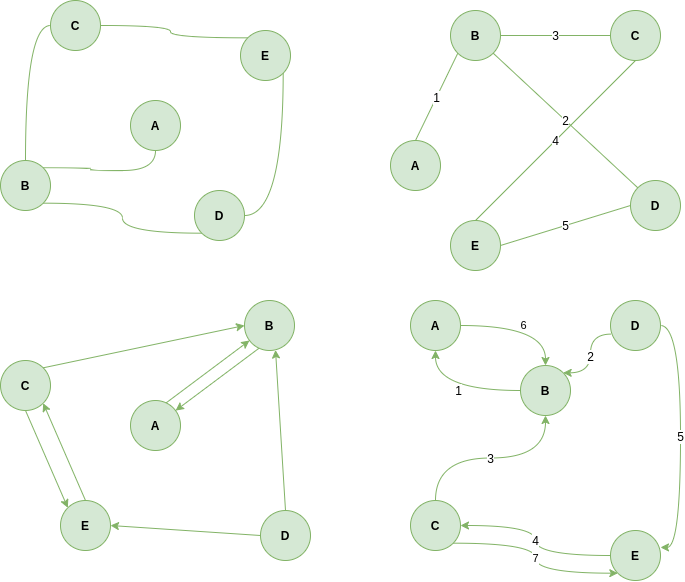
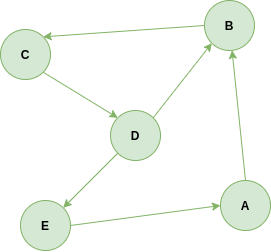

## 정의

`그래프(Graph)`는 사물이나 객체 혹은 개념간의 연결 관계를 표현하는 것으로 `정점(Vertex)`과 `간선(Edge)`로 구성된 자료구조이다. 정점의 위치나 간선의 순서등은 그래프의 정의에 포함되지 않는다. 어떠한 자료나 개념을 표현하는 정점의 집합 `V`와 이들을 연결하는 간선들의 집합 `E`으로 구성된 그래프 `G`는 다음과 같이 표시한다.

> G = (V, E)

## 그래프의 종류

대표적으로 그래프의 종류에는 방향성을 띄는 `무방향 그래프(undirected graph)`와 `방향 그래프(directed graph)` 그리고 가중치(weight)가 있는 가중치 `그래프(weighted graph)`가 있다. 방향 그래프의 경우 `E(u, v)`는 u에서 v로 가는 간선을 갖고 있는 것이고 가중치 그래프에서 일반적으로 간선에 가중치를 둔다. 이러한 가중치는 두 지점간의 거리, 이동 시간등을 나타낼 수 있다.

그 이외에도 그래프들이 인접한 정점들끼리 겹치지 않는 두개의 그룹으로 나눠지고 서로 다른 그룹의 정점이 간선으로 연결된 그래프인 `이분 그래프(bipartite graph)`. 다른 그룹에 두 정점 사이에 두개 이상의 간선이 있을 수 있는 `다중 그래프(multigraph)` 반대로 두 정점 사이에 최대 한 개의 간선만 있는 `단순 그래프(simple graph)` 그리고 `사이클 없는 방향 그래프(directed acyclic graph)` 줄여서 `DAG`라 부르는 이 그래프는 방향성이 있을 때는 시작 지점으로부터 다시 돌아올 수 있는 경로가 없지만 방향성이 없을때는 가능할 수 도 있다.

## 그래프의 경로

그래프에서 `경로(path)`란 끝과 끝이 연결된 간선들을 순서대로 나열한 것이다. 
그래프 `G = (V, E)`에서 노드 u와 노드 v가 연결하는 경로가 존재할 경우 u와 v는 서로 연결되어 있다고 한다.
단순히 노드 u와 노드 v가 간선으로 연결되어있을 때는 `인접하다(adjacent)`라고 말하고 노드 u에서 임의의 노드로 갈 수 있을 때 노드 u와 노드 v는 `연결되었다 (connected)`고 한다. 노든 모드 쌍이 연결된 경우 connected graph라고 한다.

방향 그래프에서는 앞 간선의 끝이 뒷 간선의 시작점과 만나야 하므로 위 그래프에서 A-B-C-D-E는 경로라고 할 수 있지만 A-B-D-E는 무방향 그래프의 경우에는 가능하지만 간선의 방향이 맞지 않기 때문에 경로라고 할 수 없다.

이렇게 경로 중 한 정점을 최대 한 번씩만 지나는 경로를 `단순 경로(simple path)`라고 하고 대부분 경로라 함은 이 단순 경로를 가르킨다. 하나의 정점을 두 번 이상 지날때는 별도로 명시를 한다고 한다. 또 시작한 지점으로 되돌아오는 경로를 `사이클(cycle)` 또는 `회로(circuit)`이라고 부른다.

## 그래프의 표현 방법

그래프는 거의 대부분이 `인접 리스트(adjacency List)`와 `인접 행렬(adjacency matrix)`로 구현하는데, 리스트 구조는 밀집도가 높은 그래프에 적합하며 적은 메모리 공간을 요구하며, 행렬 구조는 빠르지만  메모리를 많이 요구한다. 실제 구현에 있어서는 이 둘을 조합해서 사용한다고 한다.

### 인접 행렬

$n×n$ 만큼의 행렬을 사용한다.

- 저장공간 $O(n^2)$
- 임의의 노드 v에 인접한 모든 노드 탐색 $O(n)$
- 임의의 간선(u, v)를 탐색 $O(1)$
- 방향 그래프일 경우 인접 행렬은 비대칭하게 된다.
- 가중치 그래프의 경우 배열의 요소에 가중치 값을 삽입한다.

### 인접 리스트

정점 집합을 표현하는 하나의 배열과 각 정점마다 인접한 정점들의 연결 리스트

- 저장 공간 $O(n+m)$ n의 노드의 수, m은 간선의 수
- 노드 개수 $2 × m $개
- 임의의 노드 v에 인접한 모든 노드 탐색 $O(degree(v))$
- 임의의 간선(u, v)를 탐색 $O(degree(u))$
- $degree(v)$ 어떤 간선 v에 인접한 모든 노드의 수를 뜻함
- 방향 그래프의 경우 m개의 노드를 갖게 된다.
- 가중치 그래프의 경우 노드에 가중치를 나타낼 수 있는 요소를 추가한다.

## 그래프 순회

`순회(traversal)`는 모든 노드를 방문하는 것을 말하는데, 대표적으로 `너비우선탐색(BFS, Breadth-First Search)`와 `깊이우선탐색(DFS, Depth-First Search)`이 있다.

### BFS

BFS의 경우 시작 노드 s로 부터 가까운 노드들 부터 탐색하는 것을 말한다.(동심원 형태)
큐를 이용한 너비우선순회
s에서 $L_i$에 속한 노드까지의 최단 경로의 길이는 i이다.
BFS를 하면서 각 노드에 대해서 최단 경로의 길이를 구할 수 있다.
그래프가 disconnected하거나 방향 그래프라면 BFS에 의해서 모든 노드가 방문되지 않을 수 있음.

### DFS