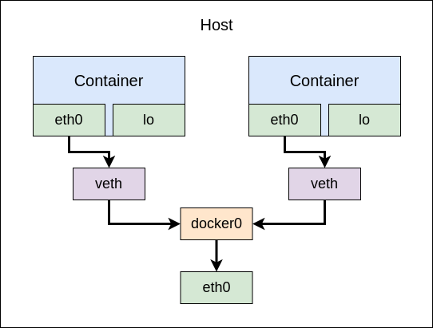
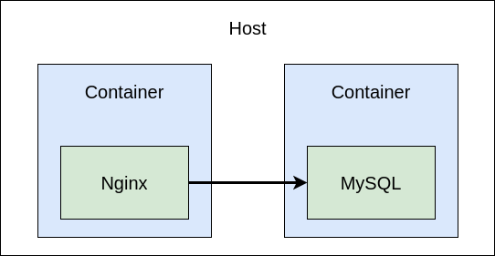

## 도커 네트워크(Docker Network)

도커 네트워크를 이용해서 각각 실행된 컨테이너를 연결하기 위한 논리적 네트워크이다. 도커는 컨테이너 내부 IP를 순차적으로 할당하며 내부 IP는 도커가 설치된 호스트에서만 사용할 수 있는데 외부와 연결해주는 것은 컨테이너가 시작할 때마다 호스트의 `veth`라는 네트워크 인터페이스를 생성하여 이루어진다. 호스트에서 `ifconfig` 명령어를 통해 네트워크 인터페이스를 확인하면 컨테이너 수 만큼 생성된 `veth`와 이들을 이어주는 `docker0`를 확인 할 수 있다.



- 컨테이너에 외부 네트워크를 제공하기 위해서 `veth`로 시작하는 가상 네트워크 인터페이스를 생성한다.
- 이는 도커 엔진이 자동으로 생성한다.
- `docker0` 브리지는 각 `veth` 인터페이스와 바인딩되어 호스트의 `eth0` 인터페이스와 이어주는 역할을 한다.

### 네트워크 기능

컨테이너를 생성하면 `docker0` 브리지를 통해 외부 네트워크를 사용할 수 있지만 다르 네트워크 드라이브를 사용할 수도 있다. 대표적으로 bridge, host, none, container, overlay 등등이 있다.

- **브리지(Bridge)**
    - `docker0`가 아닌 사용자 정의 브리지를 생성하여 컨테이너에 연결하는 네트워크 구조.
- **호스트(Host)**
    - 호스트 머신의 네트워크 환경을 그대로 사용하는 것.
- **논(None)**
    - 아무런 네트워크를 사용하지 않는 것.
- **컨테이너(Container)**
    - 다른 컨테이너의 네트워크 네임스페이스 환경을 공유할 수 있다.
    - 공유되는 것들은 내부 IP, MAC 주소등이 있다.

### 컨테이너 연결하기

도커 네트워크를 이용하여 컨테이너를 연결해보자. nginx와 mysql 이미지를 받아 각각 컨테이너를 생성하고 같은 네트워크로 지정하여 nignx에서 접근이 가능한 지 확인해 볼 것이다.



먼저 사용될 사용자 정의 도커 네트워크를 생성한다. 생성된 네트워크는 `docker network connect [container_name]`와 `docker network disconnect [container_name]`를 이용하여 붙이거나 제거할 수 있다.

```bash
> docker network create mynet
```

nginx와 mysql 컨테이너를 같은 네트워크로 지정하여 생성한다.

```bash
> docker run --name nginx -d -p 80:80 --network mynet nginx
> docker run --name mysql -d --network mynet mysql
```

`docker network inspect [network_name]` 명령어를 활용하여 네트워크의 정보와 어떠한 컨테이너가 연결되어 있는지 확인 할 수 있다.

```bash
[
    {
        "Name": "mynet",
        ...,
        "Containers": {
            "895d0511f852d907c251c6d02160a8ba30a126c0489b0f2b02c761fedc738b4d": {
                "Name": "nginx",
                ...,
                "IPv4Address": "172.18.0.2/16",
                "IPv6Address": ""
            },
            "d79260da76dbdded52c38f426a1b07c631c92bfb524dfb4697df5f8cdf2f3b5b": {
                "Name": "mysql",
                ...,
                "IPv4Address": "172.18.0.3/16",
                "IPv6Address": ""
            }
        },
        ...
    }
]
```

실제로 잘 동작하는지 확인하기 위해서 `ping` 명령어를 해본다.

```bash
> docker exec -it nginx ping mysql
PING mysql (172.18.0.3) 56(84) bytes of data.
64 bytes from mysql.mynet (172.18.0.3): icmp_seq=1 ttl=64 time=0.087 ms
64 bytes from mysql.mynet (172.18.0.3): icmp_seq=2 ttl=64 time=0.149 ms
64 bytes from mysql.mynet (172.18.0.3): icmp_seq=3 ttl=64 time=0.124 ms
```

## 참조(Reference)

- 용찬호, *시작하세요! 도커/쿠버네티스: 친절한 설명으로 쉽게 이해하는 컨테이너 관리*, (2020, 위키북스).
- "Networking overview", *Docker Docs*, https://docs.docker.com/network/.