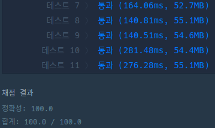
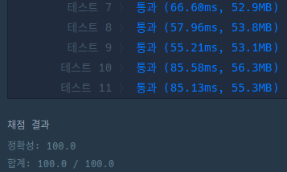

## 문제

문제 설명은 [여기](https://programmers.co.kr/learn/courses/30/lessons/77885)에서 확인할 수 있다.

## 풀이

### 규칙 찾기

문제를 보자마자 규칙이 있을 것 같이 생겼다. 적당한 수들을 나열해서 규칙이 있는지 찾아봤다.

|n (이진수)|함수 f|
|:---:|:---:|
|...|...|
|5 ($101_2$)|f(5) = 6 ($110_2$)|
|6 ($110_2$)|f(6) = 7 ($111_2$)|
|7 ($111_2$)|f(7) = 11 ($1011_2$)|
|8 ($1000_2$)|f(8) = 9 ($1001_2$)|
|9 ($1001_2$)|f(9) = 10 ($1010_2$)|
|10 ($1010_2$)|f(10) = 11 ($1011_2$)|
|11 ($1011_2$)|f(11) = 13 ($1101_2$)|
|...|...|

양의 정수 $n$이 짝수일 경우 비트의 LSB는 항상 `0`이기 때문에 캐리가 발생하지 않으므로 비트수가 달라지거나 하지 않기 때문에 무조건 1개만큼 달라지게 된다. 따라서 $n$이 짝수인 경우 $n+1$이 답이 된다.


홀수의 경우 LSB로 부터 가장 가까운 `0`의 위치를 `1`로 바꾸고 그 다음 자리 비트를 `1`로 바꾸는 형태였다. 위 그림에서 `7`같은 경우 `0111` 이므로 `0`을 `1`로 바꾼뒤 바꾼 자리의 다음 수를 0로 바꾸게 되면 `1011`로 `11`이 된다.

LSB부터 가장 가까운 `0`을 기준으로 바꾸는 이유는 주어진 $n$보다 더 크면서 그 중 가장 작은 수를 찾는 것이기 때문에, LSB에서 멀면 멀수록 더 큰 숫자를 변경하기 때문이다.

> $9_{10} = 1001_2 = 2^3 × 1 + 2^2 × 0 + 2^1 × 0 + 2^0 × 1$

예컨대 `9`를 이진수로 나타내면 위와 같이 되는데 2의 제곱과 2, 둘 중 더 작은 것을 변경해야 $n$보다 더 크면서 그 중 가장 작을 수 있게 되는 것이다.

### 일반적인 방법

```js
function solution(numbers) {
    return numbers.map(n => fn(n));
}

function fn(n) {
    if (n % 2 === 0) return n + 1;
    const bit = n.toString(2).split('');
    let pos = 0;
    for (pos = bit.length; pos > 0; pos -= 1) {
        if (bit[pos] === '0') {
            break;
        }
    }
    pos ? bit[pos] = '1' : bit.unshift('1');
    bit[pos+1] = '0';

    return parseInt(bit.join(''), 2);
}
```

만약 짝수라면 1만큼 큰 수를 반환하고 홀수인 경우 이진수로 변환을 한 다음 맨 끝에서 부터 `0`의 위치를 탐색한다.
`0`이 존재하는 경우 해당 위치를 기준으로 `1`과 `0`을 각각 바꾸어 주고, 존재하지 않을 경우 모두 `1`로 이루어져 있으므로 맨 앞에 `1`을 삽입해주고 그 다음 비트를 `0`으로 바꾸어 준 뒤 정수형으로 반환한다.



### 비트 연산자를 이용한 방법

그런데 비트나 2와 관련된 이러한 문제들을 보면 비트 연산자를 이용해서 풀 수 있는 방법이 있을 것 같은데 이 문제도 비트 연산을 이용해서 풀 수 있다.
첫 번째는 LSB로부터 가장 가까운 `0`의 위치를 찾는 것이었다. 자바스크립트에서 `~` 연산은 해당 수의 비트를 모두 반전 시켜 버린다. 즉, 1의 보수가 되는 것이다.

> 11 = $0000...1011_2$ \
~11 = $1111...0100_2 = -12$

주어진 수 $n$의 비트를 모두 반전 시킨 값과 $n+1$의 비트를 `&` 연산을 하면 $n$의 `0`이 있던 자리가 `1`로 나타나게 된다. 이 값을 $p$라 하겠다.

> $1111...0100_2$ \
> $0000...1100_2$ \
> AND \
> ---------------- \
> $0000...0100_2 = p = 4$

LSB로 `0`이 처음 나타나는 위치를 파악했다면 두 번째는 해당 위치를 기준으로 `0`과 `1`을 바꿔주어야 한다. $n$과 $p$를 `|` 연산을 하게 되면 해당 비트 수에서 가장 큰 값이 나오게 된다. `11`의 경우 비트로 나타내면 `1011`이므로 4자리 비트 중 가장 큰 `1111`인 $2^4 - 1$이 나오게 된다.

> $0000...1011_2$ \
> $0000...0100_2$ \
> OR \
> ---------------- \
> $0000...1111_2$

앞서 구한 $p$를 우측 시프트 1만큼하고 비트 반전을 하게 되면 `0`의 위치를 옮긴 것과 같은 효과가 발생한다.

> $0000...0100_2 >> 1 = 0000...0010_2$\
> ~$0000...0010_2 = 1111...1101_2$

이 값을 양수로 바꾸어야 하므로 앞서 구한 해당 비트 수에서 가장 큰 값과 `&` 연산을 하면 원하는 결과를 도출할 수 있다.

> $1111...1101_2$ \
> $0000...1111_2$ \
> AND \
> ---------------- \
> $0000...1101_2 = 13$

```js
function solution(numbers) {
    return numbers.map(n => {
        const res = fn(BigInt(n)).toString();
        return parseInt(res, 10);
    });
}

function fn(n) {
    if (BigInt(n) % 2n === 0n) return BigInt(n + 1n);
    const zero = BigInt(~n) & BigInt(n + 1n);
    return BigInt((BigInt(n) | zero) & ~(zero >> 1n));
}
```

자바스크립트에서는 배정밀도 부동소숫점 형식으로 수를 나타내기 때문에 $-(2^{64}-1)$ ~ $2^{64}-1$ 사이의 값을 정수로 나타낼 수 있는 것이 아니라 $-(2^{53}-1)$ ~ $2^{53}-1$ 사이의 정수만 안전하게 나타낼 수 있다. 문제의 제한사항을 보면 주어지는 수 중 가장 큰 수는 `Number.MAX_SAFE_INTEGER`를 넘지 않지만 결과 값이 이를 초과할 수 있기 때문에 `BigInt`형을 사용한다.



## 참조(Reference)

- Expression and Operators, *MDN*, https://developer.mozilla.org/ko/docs/Web/JavaScript/Guide/Expressions_and_Operators#%EB%B9%84%ED%8A%B8_%EC%97%B0%EC%82%B0%EC%9E%90.
- Number.MAX_SAFE_INTEGER, *MDN*, https://developer.mozilla.org/ko/docs/Web/JavaScript/Reference/Global_Objects/Number/MAX_SAFE_INTEGER%E3%85%81.