## 개요

최근에 베지어 곡선을 그려볼 수 있는 간단한 프로젝트를 진행했다. 만들때에는 이론적인 부분보다 구현에 초점을 맞추어 여러 자료들과 블로그를 찾아보면서 만들었다. 그러나 그 밑배경에는 내 생각보다 더 다양한 이론과 지식이 존재하고 있었고 해당 프로젝트에 대해 기록도 남기고 간단하게 정리하려고 글을 작성한다. 제작된 데모는 [여기](https://apexcel.github.io/bezier-curve-demo/)에서 실행 해 볼 수있다.

## 베지어 곡선(Bezier Curve)

> 베지에 곡선 혹은 베지어 곡선(Bézier Curve)은 $n$개의 점으로부터 얻어지는 $n-1$ 1차 곡선으로 수치 해석 분야에서 상당히 중요한 위치를 차지하고 있다. 특히 3차 베지에 곡선은 포스트스크립트 글꼴, 메타폰트(METAFONT), 김프 등에서 부드러운 곡선을 생성하는 데에 이용되고 있으며, 트루 타입 폰트에는 2차 베지에 곡선 알고리즘을 사용한다.
프랑스의 자동차 제조사 르노사의 기술자인 피에르 베지에가 1962년 자동차 몸체 디자인에 사용하면서부터 널리 알려졌다.

포토샵의 펜 툴을 이용한 이미지를 그릴때나 CSS 애니메이션에서도 볼 수 있는등 다양한 곳에서 사용된다.

## 조절점(Control Point)

베지어 곡선은 **조절점(control point)**을 이용하여 만든다. 두 개의 점을 이어야 하기 때문에 조절점은 2개 이상이면 된다. 다만 조절점이 많을 수록 계산하는데에 시간이 많이 걸리며 실제로 많은 조절점을 이용하는 경우는 드물다.

    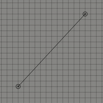

조절점이 2개인 경우

    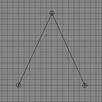

조절점이 3개인 경우

    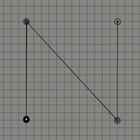

조절점이 4개인 경우

위의 그림들은 각각 조절점이 2개, 3개 그리고 4개인 경우이다. 보통 조절점이 $n$개인 경우 $n-1$차 베지어 곡선이라고 표현한다. 1차 베지어 곡선, 2차 베지어 곡선 그리고 3차 베지어 곡선으로도 표현할 수 도 있다.
이 곡선은 항상 조절점들의 [볼록 껍질(convex hull)](https://ko.wikipedia.org/wiki/%EB%B3%BC%EB%A1%9D_%EA%BB%8D%EC%A7%88)안에 존재하는데 간단히 설명하자면 볼록 껍질이란 2차원 평면에 여러 점들이 있을 때 모든 점들을 포함하는 다각형을 만드는 것을 의미한다.

## 평균과 혼합(Averaging and Blending)

### 평균

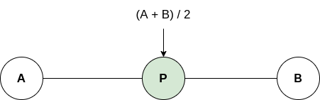

임의의 수 $a$와 $b$의 평균을 구하는 방법은 $\frac{a + b}{2}$가 될 것이다. 이를 변환 시키면 다음과 같이 나타 낼 수도 있다.

> $P = (A + B) / 2$ \
$= (A / 2) + (B / 2)$ \
$= (0.5 × A) + (0.5 × B)$

따라서 평균은 $A$의 절반과 $B$의 절반을 더한다고 말할 수 있으며 A와 B를 50대 50으로 혼합한다고 말할 수 있다.

### 혼합

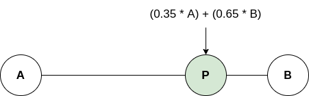

50대 50의 비율이 아니라 25대 75 또는 35대 65의 비율로 혼합할 수도 있다. 비율의 합이 100(또는 1)이 되는 범위에서 가중치를 다르게 줄 수 있다. 여기서 각각의 가중치를 $s$와 $t$로 치환하면 식을 다시 쓸 수 있다.

> $P = (s × A) + (t × B)$

그런데 비율의 합이 1이 되어야 한다고 했으므로 $s + t = 1$이 될 것이다. 따라서 $s$는 $1-t$로 바꿀 수 있고 다시 식을 적으면 아래와 같다.

> $P = ((1-t) × A) + (t × B)$

이제는 $t$값 하나로 A와 B의 혼합을 조절할 수 있게 되었다. $t = 0$인 경우 $P$의 값은 $A$가 될 것이고 $t = 1$인 경우 B가 될 것이다. 이를 다른 말로 풀이하면 $A$에서 시작하여 $A$에서 $B$까지의 거리 일부분을 더한다고 볼 수도 있다. 위와 아래의 공식 모두 $t = 0$이라면 $A$를 $t = 1$이면 $B$라는 결과를 도출한다.

> $A + t × (B - A)$

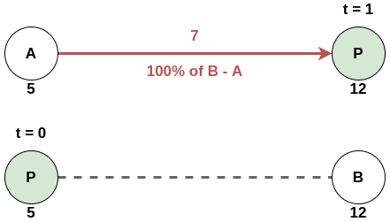

### 복합 데이터의 혼합(Blending Compound Data)

단순히 숫자뿐이 아니라 2차원이나 3차원의 벡터를 혼합할 수도 있다. 3차원 벡터의 경우 각각의 값을 블렌딩해주면 된다.

> $P_x=(s×A_x)+(t×B_x)$ \
$P_y = (s × A_y) + (t × B_y)$ \
$P_z = (s × A_z) + (t × B_z)$

벡터의 경우를 예시로 들면 아래의 그림과 같이 나타낼 수 있다.

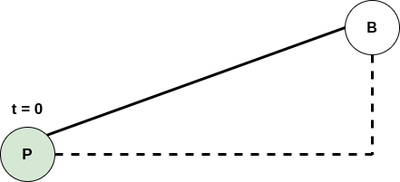
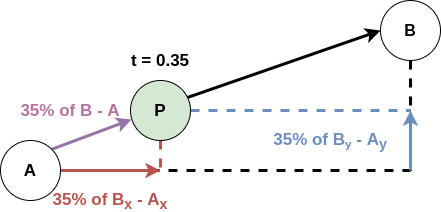
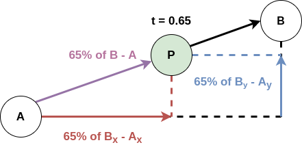
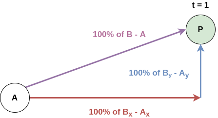

## 보간(Interpolation)

**보간(interpolation)**은 lerpring이라고도 불리는데, 시간의 흐름에따라 블렌딩의 가중치의 값($t$)을 변화시켜 혼합을 수행하는 것이다. 한 번에 원하는 위치로 이동하는 것이 아닌 위 그림과 같은 손잡이를 돌리는 것처럼 연속적으로 이루어진다. 보통 2가지 방법을 사용한다고 한다. 게임 프로그래밍에서는 메인 루프에서 일반적으로 `Update()`와 같은 이름을 가진 메소드로 표현된다. 이 메소드안에서 매 시간마다 어떻게 보간을 할 것인지를 결정하는 코드를 작성하게 된다.

- 매개변수 평가(parametric evaluation): 여러번의 프레임에 걸쳐 시작점과 끝 점을 혼합하는 방법
- 수치 적분(numerical integration): 현재 위치에서 도달해야할 곳으로 이동하는 속도를 혼합하는 방법

이에 대해 자세하게 파고들지는 않을 것이다. 어쨌거나 시간에 따라 혼합하는 것을 보간이라고 한다.

### 카스텔조 알고리즘(De Casteljau's Algorithm)

[카스텔조 알고리즘](https://en.wikipedia.org/wiki/De_Casteljau%27s_algorithm)은 재귀적인 선형 보간법으로 베지어 곡선을 시각적으로 표현할 수 있는 방법이다.

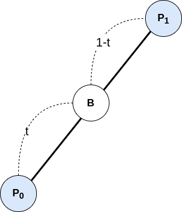

먼저 1차 베지어 곡선이다. 두 점 $P_0$와 $P_1$이 있을 때 두 점을 선형 보간한 지점을 찾는다.

> $B_x = ((1-t) × P0_x) + (t × P1_x)$ \
$B_y = ((1-t) × P0_y) + (t × P1_y)$

앞서 평균과 혼합에서 나온 공식과 같다.

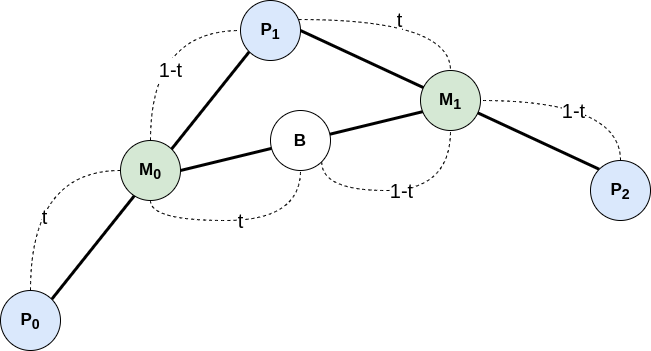

2차 베지어 곡선은 아래와 위와 같이 세 점 $P0$, $P1$ 그리고 $P2$가 존재할 때 $P0$과 $P1$을 보간한 점 $M0$을 찾고 $P1$과 $P2$의 보간한 점 $M1$을 찾는다. 그리고 다시 $M0$와 $M1$을 보간하면 $t$에 관한 2차 함수가 나오게 된다. 앞서 $n$개의 조절점이 있는 경우 $n-1$차 베지어 곡선이라 부르는 이유를 이제는 알 수 있게 되었다. 점의 개수에 따라 $n-1$차의 함수가 나오기 때문이다.

> $M0(t) = s × P_0 + t × P_1$ \
> $M1(t) = s × P_1 + t × P_2$ \
> $B(t) = s × M_0 + t × M_1$

$B(t)$는 $M0$에서 $M1$까지 보간되는 값이다. 이 값을 이용해 치환하자.

> $B(t) = (s × (s × P_0 + t × P_1)) + (t × (s × P_1 + t × P_2))$ \
$= s^2P_0 + st × P_1 + st × P_1 + t^2P_2$ \
$= s^2P_0 + 2stP_1 + t^2P_2$

$s = 1 - t$이므로 이 식을 이용해서 $t$에 값을 대입해보면

> $B(0) = 1 × P_0 + 2 × 0 × P_1 + 0 × P_2 = P_0$ \
$B(1) = 0 × P_0 + 2 × 0 × P_1 + 1 × P_2 = P_2$

$t = 0$일 때 시작점이어야 하므로 $P_0$이 나오게 되고 $t = 1$일 때 끝 점이어야 하므로 $P_2$이 나오는 것을 확인할 수 있다. 따라서 우리가 원하는 값을 도출해낼 수 있다. 2차 베지어 곡선의 경우 점 3개의 혼합으로 계산할 수 있는 것 처럼 3차 베지어 곡선의 경우 점이 4개이므로 4개의 혼합을 통해 찾은 점 3개의 혼합으로 2차 베지어 곡선을 만들고 다시 보간을 이용하여 3차 베지어 곡선을 만들 수 있다. 이를 이용해 $n$차 베지어 곡선에 대해서도 같은 방법을 수행할 수 있다.

### 비균일성(Non-Uniformity)

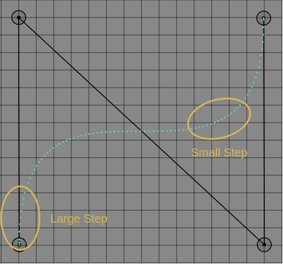

그림에서 보듯이 점들이 간격이 상대적으로 넓은 부분과 빼곡한 부분이있다. 대부분의 곡선들은 이처럼 비균일적이며 밀도나 속력이 변한다는 것을 알 수 있다. 이를 이용한 것 중 하나가 CSS에서의 `transition-timing-function`의 `cubic-bezier(x1, y1, x2, x2)`인데, 이는 양 끝의 조절점을 제외하고 나머지 두개의 조절점을 이용해 step의 간격이 큰 부분의 경우 애니메이션의 속도가 빠르게 진행되고 step의 간격이 작을 때는 천천히 진행되는 것이다.

이론적인 부분에 대해 간략히 정리를 했고 다음 포스트에서 코드를 살펴볼 것이다.

## 참조(References)

- "선형 보간법", *Wikipedia*, https://ko.wikipedia.org/wiki/%EC%84%A0%ED%98%95_%EB%B3%B4%EA%B0%84%EB%B2%95.
- "베지에 곡선", *Wikipedia*, https://ko.wikipedia.org/wiki/%EB%B2%A0%EC%A7%80%EC%97%90_%EA%B3%A1%EC%84%A0.
- "De Casteljau's algorithm", *Wikipedia*, https://en.wikipedia.org/wiki/De_Casteljau%27s_algorithm.
- "베지어 곡선", *Javascript Info*, https://ko.javascript.info/bezier-curve.
- Squirrel Eiserloh, "Interpolation and Splines", *Essential Math for Games Programmers*, https://www.essentialmath.com/tutorial.htm.
- "프런트엔드 엔지니어를 위한 베지에 곡선(Bezier Curves) - 2편", *Coderifleman's blog*, https://blog.coderifleman.com/2017/01/03/bezier-curves-for-frontend-engineer-2/.
- "프런트엔드 엔지니어를 위한 베지에 곡선(Bezier Curves) - 1편", *Coderifleman's blog*, https://blog.coderifleman.com/2017/01/02/bezier-curves-for-frontend-engineer-1/.
