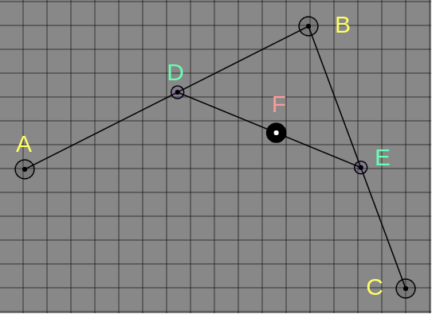

## 개요

1편에서는 이론적인 부분에 대해 간략히 소개했다. 그래서 이번 포스트에서는 해당 프로젝트의 기능들에 대해서 살펴보고 설명할 것이다. 코드가 생략된 부분이 많은데 전체 코드를 [깃허브](https://github.com/apexcel/bezier-curve-demo)에서 보면 몇 줄 안되고 어려운 부분도 없다. [데모](https://apexcel.github.io/bezier-curve-demo/)를 온라인 상으로 실행해볼 수 있다.

## 좌표 생성 및 이벤트

### 좌표 생성 및 삭제

```js
// Board.js
init = () => {
    // initiate some...
    this.state = {
        selected: -1,
        coords: [],
    };
    this.canvas.addEventListener('dblclick', this.markCurrentPosition);
}

// utils.js
const getMousePosition = ev => ({
    x: ev.offsetX,
    y: ev.offsetY
});
```

먼저 `dblclick` 이벤트로부터 더블 클릭한 현재 마우스의 좌표 값을 가져오는 함수를 만들고 이 좌표를 `coords` 배열에 담아 둘 것인데 화면상의 표시와 좌표의 선택, 삭제 등등에 필요하다.

```js
// Board.js
markCurrentPosition = (ev) => {
    const { x, y } = getMousePosition(ev);
    this.probeDotList(x, y);
    if (this.state.selected >= 0) {
        this.state.coords = this.state.coords.filter((_, i) => i !== this.state.selected);
        this.state.selected = -1;
    }
    else {
        this.state.coords.push({ x, y });
    }
}
```

`markCurrentPosition()`은 더블 클릭 이벤트가 발생했을 때 `getMousePosition()`을 호출하여 좌표값을 받고 `probeDotList()`를 호출한다. `probeDotList()`는 현재 더블 클릭한 좌표 반경에 이미 기존의 값이 있는지 탐색하고 선택된 좌표가 존재하는 경우 `selected` 값은 `coords`배열에서 좌표가 위치하는 인덱스 값이 된다. 따라서 `selected`가 `0`보다 큰 경우 기존에 존재하는 좌표 반경을 더블 클릭하였다는 것이므로 선택된 좌표를 배열에서 제거하고 그렇지 않은 경우 새로운 좌표값을 배열에 추가한다.

### 좌표 탐색

```js
// Board.js
probeDotList = (inputX, inputY) => {
    for (let i = 0; i < this.state.coords.length; i += 1) {
        const { x, y } = this.state.coords[i];
        if (this.isExist(x, y, inputX, inputY)) {
            return this.state.selected = i;
        }
    }
}

isExist = (x, y, inputX, inputY) => {
    const radius = 10;
    const xpb = x + radius;
    const xnb = x - radius;
    const ypb = y + radius;
    const ynb = y - radius;
    return (x >= -1 && y >= -1 && x <= WIDTH && y <= HEIGHT && (inputX <= xpb && inputX >= xnb && inputY >= ynb && inputY <= ypb));
}
```

`probeDotList()` 메소드는 `coords`배열을 순회하면서 `isExist()` 메소드를 호출한다. `isExist()` 메소드는 더블 클릭한 좌표가 캔버스 영역 내부에 존재하는지 그리고 좌표 반경내에 클릭이 되었는지에 대한 여부를 불리언 값으로 반환한다. 이 값이 `true`인 경우 클릭한 지점에 좌표가 존재한다는 뜻이므로 `probeDotList()` 메소드에서 `selected`의 값을 `coords`배열에 존재하는 좌표의 인덱스 값으로 설정한다.

반대로 더블 클릭한 좌표 부근에 점이 없는 경우 `probeDotList()`는 아무일도 하지 않으므로 `selected`는 `-1`일 것이고 `markCurrentPosition()`에서 새로이 좌표가 생성된다.

### 좌표 이동

```js
// Board.js
init = () => {
    // ...initiate some
    this.canvas.addEventListener('mousedown', this.onMouseDown);
    this.canvas.addEventListener('mousemove', this.onMouseMove);
    this.canvas.addEventListener('mouseout', this.onMouseOut);
    this.canvas.addEventListener('mouseup', this.onMouseUp);
}

onMouseDown = (ev) => {
    ev.preventDefault();
    const { x, y } = getMousePosition(this.canvas, ev);
    this.probeDotList(x, y);
}

onMouseMove = (ev) => {
    ev.preventDefault();
    if (this.state.selected < 0) return;
    this.state.coords[this.state.selected].x = ev.offsetX;
    this.state.coords[this.state.selected].y = ev.offsetY;
    // ...draw canvas
}

onMouseOut = (ev) => {
    this.state.selected = -1;
}

onMouseUp = (ev) => {
    this.state.selected = -1;
}
```

- [mousedown](https://developer.mozilla.org/en-US/docs/Web/API/Element/mousedown_event): 마우스가 눌러질 때 발생
- [mousemove](https://developer.mozilla.org/en-US/docs/Web/API/Element/mousemove_event): 마우스가 움직일 때 발생
- [mouseup](https://developer.mozilla.org/en-US/docs/Web/API/Element/mouseup_event): 마우스가 눌렸다가 떼어질 때 발생
- [mouseout](https://developer.mozilla.org/en-US/docs/Web/API/Element/mouseout_event): 타겟 엘리먼트 내에 마우스가 존재하지 않을 때 발생

`onMouseDown()` 메소드에서 클릭된 지점에 해당 하는 점이 존재하는 지 파악하고 만약 존재한다면 앞에서 설명한 것 처럼 `selected`의 값이 `coords` 배열에 존재하는 좌표의 인덱스 값이 될 것이다.

`onMouseMove()`에서 좌표가 존재하는 경우 `selected` 값이 `-1` 보다 클 것이므로 마우스가 움직인 좌표로 원본 좌표의 값을 변경해주면 된다. 마우스를 떼거나 캔버스 영역을 벗어날 때 `-1`로 설정해주도록 해서 원하지 않을 때 값이 변경되지 않도록한다.

## 애니메이션 실행

```js
// Board.js
runAnimate = () => {
    // ...do something
    this.animationState.startTime = Date.now();
    this.animate();
    return;
}

animate = () => {
    const currentTime = Date.now();
    this.raf = requestAnimationFrame(this.animate);
    this.calculateBezier((currentTime - this.animationState.startTime) / this.animationState.animateTime);

    if (currentTime - this.animationState.startTime > this.animationState.animateTime) {
        // ...draw canvas and initiate animation state
        cancelAnimationFrame(this.raf);
    }
}
```

`runAnimate()`는 애니메이션이 시작될 때 시작한 시간을 기록하고 `animate()`를 호출한다. `animate()` 메소드에서는 **requestAnimationFrame(raf)**을 이용하여 화면을 그려주는 역할을 한다. `raf`는 화면이 새롭게 리페인트 되기전에 실행할 콜백 함수를 파라미터로 받아서 콜백 함수를 실행하고 리턴 값으로 고유 `id` 값인 `0`이 아닌 정수를 반환한다. 이 값을 이용해 다음 리페인트를 위해 재귀적으로 호출하거나 [cancelAnimationFrame](https://developer.mozilla.org/ko/docs/Web/API/Window/cancelAnimationFrame)을 호출하여 중단할 수도 있다.
[requestAnimationFrame](https://developer.mozilla.org/ko/docs/Web/API/Window/requestAnimationFrame)은 자주 쓰이고 중요하므로 알아두면 좋을 것 같다.

`raf`의 콜백 함수로 넘겨준 `animate()`는 매 호출마다 시작 시간과 현재 시간 그리고 애니메이션이 진행되는 시간을 이용해서 `t` 값을 구한 다음 베지어 곡선을 계산하는 `calculateBezier()` 메소드의 파라미터로 넘겨준다.

> (현재 시간 - 시작 시간) / 실행되는 시간

- 현재 시간: 매 프레임마다 `raf`가 실행될 때 측정된다.
- 시작 시간: 최초로 애니메이션 시작이 되는 순간의 시간.
- 실행되는 시간: 전체 애니메이션이 실행되는 시간.

매 프레임마다 `t`값이 갱신되며 베지어 곡선을 계산하는 메소드를 호출하다가 전체 실행되는 시간을 초과하게 되면 애니메이션을 중지하게 된다. 실행 시간을 길게 하면 느리게 움직이고 실행 시간을 짧게하면 빨라지게 된다.

### 베지어 곡선 계산

1편에서 살펴보았듯이 블렌딩을 이용할 것이다. 먼저 1차원의 두 점을 블렌딩해주는 함수 `blender`와 2차원 좌표를 블렌딩해주는 함수 `blend`를 선언하였다. 관련된 [포스트](https://www.apexcel.blog/programming/bezier/bezier-curve/#%EB%B3%B5%ED%95%A9-%EB%8D%B0%EC%9D%B4%ED%84%B0%EC%9D%98-%ED%98%BC%ED%95%A9blending-compound-data)에서 간단한 이론적 배경을 확인할 수 있다.

```js
// utils.js
const blender = (p1, p2, t) => {
    if (t <= 0) return p1;
    if (t >= 1) return p2;
    return ((1 - t) * p1) + (t * p2);
};

const blend = (x1, x2, y1, y2, t) => {
    const x = blender(x1, x2, t);
    const y = blender(y1, y2, t);
    return { x, y };
};
```

`blender()`함수는 1차원의 두 점을 받아 `t`에 따라 보간을 계산한다. 그러나 `blender()`는 좌표에서 한 부분만 담당하므로 `blend()`함수에서 각각 따로 계산한 값을 구해준다.

```js
// Board.js
calculateBezier = (t) => {
    const calculatePosition = (coords, t) => {
        if (coords.length < 2) return;
        const calced = [];
        for (let i = 1; i < coords.length; i += 1) {
            const { x, y } = blend(coords[i - 1].x, coords[i].x, coords[i - 1].y, coords[i].y, t)
            calced[i - 1] = { x, y };
        }
        // ...draw canvas
    calculatePosition(calced, t);
};
    // ...draw canvas
    calculatePosition(this.state.coords, t);
}
```

1. `calculateBezier()`메소드는 `t`값과 생성되어 있는 조절점들의 좌표를 `caculatePosition()`에 파라미터로 넘기고 호출한다.
2. 이 함수는 넘겨 받은 좌표와 `t`값을 이용해서 각 선분에 대해서 블렌딩을 계산한다.
3. 블렌딩 계산을 마친 좌표의 값들을 `calced` 배열에 담아서 다시 자신을 호출한다.
4. 2와 3을 넘겨받은 좌표를 담은 배열의 길이가 2가 될 때 까지 반복하게 되는데 마지막 호출에서 나온 길이가 1인 좌표가 바로 베지어 곡선을 그리는 점의 좌표이다.



위 과정을 그림을 통해 보면 더블 클릭을 통해 생성한 점들 `A`, `B`, `C`는 `coords`배열에 담기게 되고 애니메이션을 실행하면 이 배열을 `calculatePosition()`에서 계산을 한다. 계산을 통해 나온 점들의 좌표가 담긴 `calced`에는 `D`, `E`가 담겨 있고 다시 `calculatePosition()`을 호출한다. 계산 결과 나온 값이 바로 `F`가 되고 이 `F`가 베지어 곡선을 그리는 점이 된다.

만들게 된 과정에 대해서 이야기를 해보자면 CSS에 보면 `animation-timing-function` 라고하는 애니메이션의 시간당 속도를 설정하는 속성이 있다. 이 속성의 값 중에 `cubic-bezier()`라는 녀석이 있는데, 궁금해서 이에 관해 찾다 보니 이걸 이용해서 갖고 놀 수 있을만한 걸 만들어볼 수 있지 않나 해서 만들게 되었다. 이미 비슷한 기능을 하는 사이트들이 있지만 직접 만들어보니 재미있었다

구현하는 건 어렵지 않았는데 과정속에 담긴 이론들을 정확히 이해하려고 하는데에 시간을 많이 쏟았던 것 같다.🤯🤯🤯 근데 찾으면 찾을수록 연관된 이론과 계산들이 많았는데 모든 걸 다 알면 좋겠지만 적당히 만족하는 수준까지만 알아보고 이 기억들을 까먹기전에 글로 메다닥 작성해서 기록하기로 했다.
그리고 [Coderifleman's blog](https://blog.coderifleman.com/2017/03/19/bezier-curves-for-frontend-engineer-3/)에 베지어 곡선과 관련하여 잘 정리되어 있으니 참고하면 좋다.

## 참조(References)

- "프런트엔드 엔지니어를 위한 베지에 곡선(Bezier Curves) - 3편", *Coderifleman's blog*, https://blog.coderifleman.com/2017/03/19/bezier-curves-for-frontend-engineer-3/.