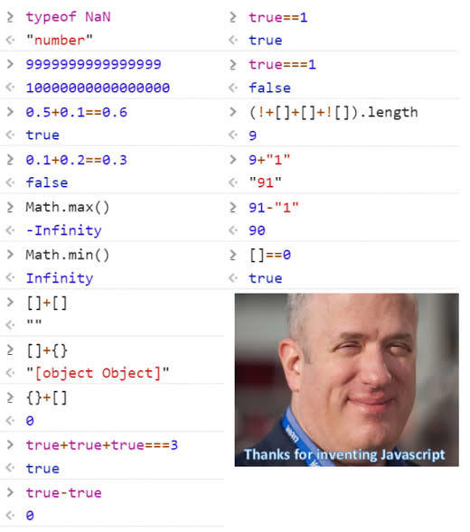

## 자바스크립트와 근삿값



인터넷에 흔히 돌아다니는 괴이한 자바스크립트 문법에 대한 사진이다. 실제로 저렇게 사용할 일은 거의 없지만 제대로 알고 쓰지 않으면 이상한데서 문제가 발생하는데 이와 관련하여 [jsisweird.com](https://jsisweird.com/)라는 사이트에서 자바스크립트를 얼마나 잘 알고 있는가 테스트할 수 있다. 본인은 14개밖에 못 맞췄다. 어쨌든 이와 관련된 문제를 해결하느라 시간을 허비했기 때문에 글을 작성한다.

자바스크립트에서는 근삿값을 구하기 위해 `Math.floor()`, `Math.ceil()`, `Math.round()`, `Math.fround()`등 다양한 함수들을 제공한다. 그 중에서도 인자로 주어진 수를 내림하여 정수 근삿값으로 반환하는 `Math.floor()`가 있다. 가끔씩 몇 글자 되지도 않는 이 함수를 쓰기 귀찮아서 `NOT`을 의미하는 비트 연산자인 `~`(물결표, tilde)을 두 번 사용하여 처리하고는 했다. 나는 둘이 같은 값을 반환하는 줄 알았는데 그게 아니었다!🤦‍♂️🤦‍♂️🤦‍♂️ 그래서 호되게 당했고 왜 그런지 알아보았다.

```js
const realNumber = 3.141592;
const bigRealNumber = 4294967296.123;

console.log(Math.floor(realNumber)); // 3
console.log(~~realNumber); // 3

console.log(Math.floor(bigRealNumber)); // 4294967296
console.log(~~(bigRealNumber)); // 0 🤔
```

### 숫자형

자바스크립트는 숫자형을 배정밀도 부동소수점 숫자로 알려진 64비트 형식의 [IEEE 754](https://ko.wikipedia.org/wiki/IEEE_754)를 사용한다. 64비트 중 54비트는 숫자를 저장하는데에 사용하고 11비트는 소수점 위치를, 나머지 1비트는 부호를 저장하는데에 사용한다.

만약 64비트를 초과하는 경우라면 `Infinity`로 처리한다. 정수로 나타낼 수 있는 최댓값과 최솟값의 범위는 $-(2^{54}-1)$에서 $2^{54}-1$이며 이를 위해 `Number.MAX_SAFE_INTEGER`와 `Number.MIN_SAFE_INTEGER` 값을 제공한다.

### 비트 연산자

자바스크립트에서 [비트 연산자(bitwise operators)](https://developer.mozilla.org/ko/docs/Web/JavaScript/Guide/Expressions_and_Operators##bitwise_operators)는 개념적으로 다음과 같이 동작한다.

1. 피연산자들을 32비트 정수로 변환하며 숫자가 32비트를 초과할 경우 가장 큰 비트부터 버린다.
2. 각 비트 자리에 대응하는 수 끼리 연산을 진행한다. 첫 번째 비트는 첫 번째 비트끼리 두 번째 비트는 두 번째 비트 끼리 그리고 32번째 비트는 32번째 비트와 연산을 한다.
3. 연산의 결과를 비트단위로 구축한다.

#### 비트 시프트 연산자

비트 연산자 중에서 시프트 연산은 비트를 움직일 수 있는데 자바스크립트는 `<<` 좌측 시프트, `>>` 우측 시프트 그리고 `>>>` 우측 [논리 시프트(logical shift)](https://ko.wikipedia.org/wiki/%EB%85%BC%EB%A6%AC_%EC%8B%9C%ED%94%84%ED%8A%B8)을 지원한다.

| 연산자 | 사용법 | 내용 |
|---|---|---|
| 왼쪽 시프트(좌측 시프트) | a >> b | 왼쪽 피연산자를 오른쪽 피연산자만큼 왼쪽으로 시프트합니다. 왼쪽으로 넘치는 비트는 버리고, 오른쪽을 0으로 채웁니다. |
| 오른쪽 시프트(우측 시프트) | a << b | 왼쪽 피연산자를 오른쪽 피연산자만큼 오른쪽으로 시프트합니다. 오른쪽으로 넘치는 비트는 버리고, 왼쪽은 제일 큰 비트의 값으로 채웁니다. |
| 부호 없는 오른쪽 시프트(우측 논리 시프트) | a >>> b |왼쪽 피연산자를 오른쪽 피연산자만큼 오른쪽으로 시프트합니다. 오른쪽으로 넘치는 비트는 버리고, 왼쪽은 0으로 채웁니다. |

#### NOT 논리 연산자와 보수

```js
function to32Bit(n) {
    console.log(n, (n >>> 0).toString(2).padStart(32, '0'));
}

to32Bit(3);   //  3 00000000000000000000000000000011
to32Bit(~3);  // -4 11111111111111111111111111111100
to32Bit(-3);  // -3 11111111111111111111111111111101
to32Bit(~~3); //  3 00000000000000000000000000000011
```

자바스크립트에서 `NOT` 연산자인 `~`는 비트를 전부 반대 비트로 뒤집는다. 즉, [1의 보수(ones' complement)](https://ko.wikipedia.org/wiki/1%EC%9D%98_%EB%B3%B4%EC%88%98)가 된다. 또, 주어진 수의 비트를 모두 반전 시킨뒤 1만큼 더하면 [2의 보수(two's complement)](https://ko.wikipedia.org/wiki/2%EC%9D%98_%EB%B3%B4%EC%88%98)를 얻을 수 있는데 대부분의 산술 연산에서는 이를 원래 수의 음수로 취급한다. 비트 연산자의 규칙에 의해 위와 같이 적용된다.

## 결론

```js
to32Bit(2 ** 32 - 1);     //  4294967295  11111111111111111111111111111111
to32Bit(~(2 ** 32 - 1));  //  0           00000000000000000000000000000000
to32Bit(-(2 ** 32 - 1));  // -4294967295  00000000000000000000000000000001
to32Bit(~~(2 ** 32 - 1)); // -1           11111111111111111111111111111111
```

위의 내용을 종합해보면 비트 연산자를 사용하는 경우 32비트보다 큰 비트와 가수(fraction)부분의 비트들을 버리게 되므로 32비트 정수가 되고, `NOT` 연산을 적용하면 1의 보수가 된다. 따라서 이중 물결표를 32비트 이하 수 사용하는 것은 `Math.floor()`와 동일한 일을 수행한다고 할 수 있다. 그러나 32비트를 넘어가는 수에 대해서는 제대로 동작하지 않는다. 따라서 근삿값을 구할 때는 적절한 함수를 사용하는 것이 좋다.

## 참조(Reference)

- "숫자형", *Javascript Info*, https://ko.javascript.info/number.
- "JS is Weird", *jsisweird*, https://jsisweird.com/.
- "IEEE 754", *Wikipedia*, https://ko.wikipedia.org/wiki/IEEE_754.
- "1의 보수", *Wikipedia*, https://ko.wikipedia.org/wiki/1%EC%9D%98_%EB%B3%B4%EC%88%98.
- "논리 시프트", *Wikipedia*, https://ko.wikipedia.org/wiki/%EB%85%BC%EB%A6%AC_%EC%8B%9C%ED%94%84%ED%8A%B8.
- "Negative numbers to binary string in JavaScript", *Stack overflow* https://stackoverflow.com/questions/16155592/negative-numbers-to-binary-string-in-javascript.