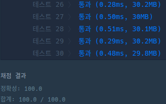

## 문제

문제 설명은 [여기](https://programmers.co.kr/learn/courses/30/lessons/67257)에서 확인할 수 있다.

## 풀이

문제 설명에서 친절히도 사용되는 연산자 `*`, `+`, `-` 이 3가지의 순열을 명시해주고 있다. $3! = 6$ 이므로 연산자 우선 순위를 하드 코딩한 다음 각 연산자에 맞는 연산을 실행 하는 함수를 선언하고 반복문으로 구성했다.

```js
const calculate = (array, operator) => {
    array = array.map(v => parseInt(v, 10));
    if (operator === '*') {
        return array.reduce((acc, cur) => acc * cur);
    }
    else if (operator === '+') {
        return array.reduce((acc, cur) => acc + cur);
    }
    else {
        return array.reduce((acc, cur) => acc - cur);
    }
};

const solution = expression => {

    const cycle = [
        '*+-',
        '*-+',
        '+*-',
        '+-*',
        '-*+',
        '-+*',
    ];

    let max = 0;
    for (let i = 0; i < 6; i += 1) {
        const op = cycle[i];
        const value = calculate(expression.split(op[2]).map(v => calculate(v.split(op[1]).map(k => calculate(k.split(op[0]), op[0])), op[1])), op[2]);
        if (Math.abs(value) > max) max = Math.abs(value);
    }
    return max;
};
```



더 좋은 풀이가 있을 것 같은데 잘 모르겠다.🤔🤔🤔 풀었으니 일단 다른 문제로 넘어가야지.