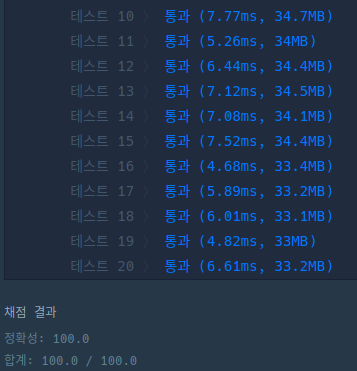

## 문제

문제 설명은 [여기](https://programmers.co.kr/learn/courses/30/lessons/72411)에서 확인할 수 있다.

## 문제를 제대로 읽자

일단 문제 설명을 제대로 이해 못해서 시간을 많이 잡아먹었다. 예시를 보면 있어야 할 조합이 왜 없는지에 대해 고민했는데, 다음과 같은 예시를 보자.

|손님 번호|주문한 단품 메뉴 조합|
|:---:|:---:|
|1번|A, B, C, F|
|2번|A, B, E|
|3번|C, D, F|
|4번|A, C, E, F|

여기서 2개로 구성된 메뉴 조합을 만들때 `AB` 같은 건 해당 되지 않는다. 아무 생각 없이 풀다 보니 2명 이상이 주문했는데 왜 포함이 안 되는 건지 헤메고 있었는데, 제한사항을 자세히 읽어보면

> 만약 가장 많이 함께 주문된 메뉴 구성이 여러 개라면, 모두 배열에 담아 return 하면 됩니다.

라고 적혀있다. 따라서 구성될 메뉴 조합중에서 가장 많이 주문 된 메뉴 조합이 하나라면 그것을 반환하고 여러개라면 배열에 담아 반환하라는 뜻이었다. 그래서 위의 예시의 경우 `CF`만 반환하게 된다. 이래서 문제를 제대로 읽어야한다.

## 풀이

전체 주문 된 메뉴를 조합될 메뉴의 숫자만큼 조합을 했다. 반환할 때 오름차순으로 반환 해야하기 때문에 중간에 적절히 정렬을 해주면된다.

```js
function solution(orders, course) {
    const result = [];
    let total = new Map();

    const pick = (begin, order, len, temp) => {
        if (temp.length === len) {
            const alpha = temp.slice(0).sort().join('');
            total.set(alpha, total.get(alpha) + 1 || 1);
            return;
        }

        for (let i = begin; i < order.length; i += 1) {
            temp.push(order[i]);
            pick(i + 1, order, len, temp);
            temp.pop(order[i]);
        }
    };

    for (let i = 0; i < course.length; i += 1) {
        const len = course[i];
        let max = 2, temp = [];
        total = new Map();

        for (let i = 0; i < orders.length; i += 1) {
            pick(0, orders[i], len, temp);
        }

        let strings = [];
        for (const [alpha, count] of Array.from(total)) {
            if (count < max) continue;
            if (count > max) {
                max = count;
                strings = [alpha];
            }
            else if (count === max) strings.push(alpha);
        }
        result.push(...strings);
    }
    return result.sort();
}
```

그리고 한 가지 실수를 했었는데 자바스크립트는 선언한 객체를 다른 변수에 할당하면 값이 복사가 되는 것이 아니라 메모리 어딘가에 존재하는 객체를 참조할 뿐이다.

```js
const alpha = temp.slice(0).sort().join(''); // O
const alpha = temp.sort().join(''); // X
```

그래서 두 번째 같이 `alpha`에는 정렬한 문자열이 들어가고 `temp`는 아무 영향이 없을거라고 생각하면 안된다. `slice()`를 이용해서 새로운 배열 객체로 복사해야한다.

